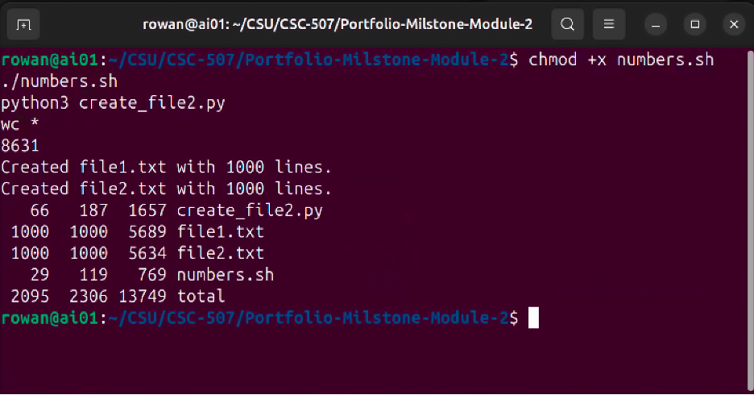

# Portfolio Milestone Module 2 

Date: 05/24/2026  
Grade: 100% | A

---

Foundation of Operating Systems CSC507  
Professor: Dr. Joseph Issa 
Spring C (26SC) – 2026   
Student: Alexander (Alex) Ricciardi 

---
Program Requirements:
- Ubuntu Desktop 24.04.1 LTS
- Bash or a Linux shell
- Python 3

---

## How to Run in the Linux Terminal

Run these commands from the repository root:

```bash
cd Portfolio-Milstone-Module-2
chmod +x numbers.sh
./numbers.sh
python3 create_file2.py
wc *
```

Expected result:

- `numbers.sh` creates `file1.txt` with 1,000 random-number lines.
- `create_file2.py` creates `file2.txt` with 1,000 random-number lines.
- `wc *` shows the line, word, and byte counts for the script, Python program, and generated text files.

The script should be run from the `Portfolio-Milstone-Module-2/` directory so `file1.txt` and `file2.txt` are created in the correct assignment folder.

Note: `wc *` counts every file in the current folder. If `README.md` or `terminal.png` is also present, those files will be included in the `wc *` output. To count only the required assignment files, run:

```bash
wc create_file2.py file1.txt file2.txt numbers.sh
```

## Terminal Output Evidence

The file `terminal.png` shows the Linux terminal after the Bash script, Python program, and `wc *` verification command were run successfully.



---

## File Map

| File | Purpose |
| :--- | :--- |
| `README.md` | Assignment description, run instructions, grading rubric, and file map. |
| `numbers.sh` | Bash script for the required `$RANDOM` workflow. It demonstrates writing, appending, removing `file1.txt`, then recreates `file1.txt` with 1,000 random-number lines using a `for` loop. |
| `create_file2.py` | Python program selected for the programming-language requirement. It creates `file2.txt` with 1,000 random-number lines. |
| `file1.txt` | Bash-generated output file containing 1,000 random-number lines. |
| `file2.txt` | Python-generated output file containing 1,000 random-number lines. |
| `terminal.png` | Terminal-output evidence image showing `chmod +x numbers.sh`, `./numbers.sh`, `python3 create_file2.py`, and `wc *` run successfully. |

No screenshot-generation code is included in this folder; `terminal.png` is a manually added evidence image.

---

## Assignment


**This assignment is a Portfolio Milestone for Module 2**

Portfolio Milestone Project: Bash and Python Scripting

Using Python Programming language
In your Linux installation, use Bash, or a Linux Shell of your choice, to do the following:

1. Generate a random number: echo $RANDOM
2. Output a random number into a file called file1.txt: echo $RANDOM > file1.txt
3. Append another random number to the end of this file: echo $RANDOM >> file1.txt
4. Remove file1.txt: rm file1.txt
5. Create a script called numbers.sh, that does this one thousand (1000) times, using the “for” loop.
6. Make the script executable: chmod +x numbers.sh
7. Run the script: ./numbers.sh

If you are not familiar with Linux Shell scripting, review the following videos:

Simpson, S. (2025, July 1). Learning bash scriptingLinks to an external site. [Video]. LinkedIn Learning. 

Simpson, S. (2025, July 1). Working with while and until loopsLinks to an external site. [Video]. LinkedIn Learning.

You should now have a file called file1.txt containing 1,000 lines, with each line being a random number.

Create a Python program to perform this task, to create file2.txt. You should now have 2 files: file1.txt & file2.txt, each containing 1,000 lines, with each line being a random number.

Do a word and line count on these programs, scripts, and text files (feel free to create a new folder(s) to store these, if you prefer a certain level of organization.)

wc *

Take a screenshot of the files and their word/line counts and submit to the instructor.

### For context

**Portfolio Project** Working with Big Data using Multithreading
The goal of this project is to use the concepts taught in this course to develop an efficient way of working with Big Data.

You should have 2 files in your Linux system: hugefile1.txt and hugefile2.txt, with one billion lines in each one. If you do not, please go back to the Module 7 Portfolio Reminder and complete the steps there.

Create a program, using a programming language of your choice, to produce a new file: totalfile.txt, by taking the numbers from each line of the two files and adding them. So, each line in file #3 is the sum of the corresponding line in hugefile1.txt and hugefile2.txt.

For example, if the first 5 lines of your files look as follows:

$ head -5 hugefile*txt

==> hugefile1.txt <==

4131

29929

6483

7659

25003

==> hugefile1.txt <==

8866

19171

11029

4889

27069

then the first 5 lines of totalfile.txt look like this:

$ head -5 totalfile.txt

12997

49100

17512

12548

52072
Because the files of such large sizes cannot be read into memory in their entirety at the same time, you need to use concurrency. Reading the files one line at a time will take a long time, so use what you have learned in this course to optimize this process. Be sure to record the amount of time it takes for each version of your program to complete this task.

Optimize the program by using threads, so that you benefit from multiple cores in your CPU. Create a multithreaded program, where each thread works on the next chunk of the file.

Now, break up hugefile1.txt and hugefile2.txt into 10 files each, and run your process on all 10 sets in parallel. How do the run times compare to the original process?

Explain your methods and results in detail. What conclusions can you make about the different methods of optimizing large file processing? How has the information that you learned in this course helped you to accomplish this task?

Your paper should be 2-3 pages in length and conform to CSU Global Writing Center. Include at least 3 references in addition to the course textbook. The CSU Global Library is a good place to find these references. You can access the Writing Center and Library by clicking on the links in the course navigation panel.

**Portfolio Reminder Module 8**

From the previous you should have 2 files in your Linux system: file1.txt and file2.txt, with one million lines in each one. Use them to create 2 files with one billion lines each: hugefile1.txt and hugefile2.txt. Your script might look as follows:

#!/bin/bash
for i in {1..1000}
do
  cat file1.txt >> hugefile1.txt
  cat file2.txt >> hugefile2.txt
done

Run this script, then verify that you now have 2 files with one billion lines each:

wc -l hugefile*txt

---

My Links:

<a href="https://www.alexomegapy.com" target="_blank"></a>
<a href="https://www.alexomegapy.com" target="_blank"></a>

[](https://medium.com/@alex.omegapy)
[](https://x.com/AlexOmegapy)
[](https://www.youtube.com/channel/UC4rMaQ7sqywMZkfS1xGh2AA)
[](https://www.facebook.com/profile.php?id=100089638857137)
[](https://linkedin.com/in/alex-ricciardi)

<a href="https://www.threads.net/@alexomegapy?hl=en" target="_blank"></a>
<a href="https://dev.to/alex_ricciardi" target="_blank"></a><br>
