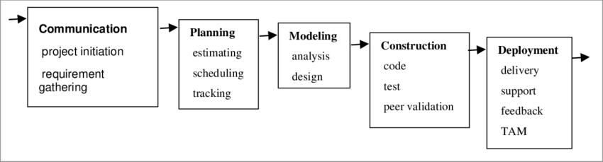

# Critical Thinking 2
Program Name: Critical Thinking Assignment 2 – Development and Design Model

Data:  11/23/2025  
Grade: 1000% A

---

CSC505 Principal of Software Development – Python Programming   
Professor: Dr. Joseph Issa  
Winter A (25WA) – 2025   
Student: Alexander (Alex) Ricciardi

---

**Program Description:**

The program is part of the Develop a Python Script section of the assignment, it is a console program that:  
    1. Prompts users for how many phases their model has  
    2. Prompts users for the name and a short description of each phase in their model  
    3. Prints a well formatted summary:  

    Phase 1: Discovery - Understand user needs and priorities
    Phase 2: Iterative Design - Develop, test, and refine features

---

Requirements:  

---

**Assignment Directions:**  

Consider the traditional Waterfall Model, which includes sequential stages: communication, planning, modeling, construction, and deployment (Adapted from Pressman, 2020, p. 26). While foundational, this model has limitations in today's fast-changing software environments.
  
The Waterfall Model includes: Communication (project initiation, requirement gathering), planning (estimating, scheduling, tracking), modeling (analysis, design), construction (code, test, peer validation), and deployment (delivery, support, feedback, TAM).
(Adapted from Pressman, 2020, p. 26)

For this assignment, you will evaluate the Waterfall Model’s shortcomings and design a modernized version called the YourLastName Adaptive Model. You will visualize it with a UML-style diagram and simulate user interaction using a Python script.

**Instructions:**

Evaluate the Waterfall Model:  
- Briefly identify at least three limitations of the traditional Waterfall Model (e.g., lack of flexibility, late testing, poor adaptability to change).

Design the YourLastName Adaptive Model:
- Using your findings, design a modernized process model. You may integrate principles from Agile, DevOps, or Spiral methodologies.   
Your model should still include major phases, but with added adaptability or feedback loops.

Create a UML Diagram:  
Create a visual diagram of your model using one of the following tools
- UMLetLinks to an external site.
- GliffyLinks to an external site.
- Microsoft Visio (optional, if already available)
Export your diagram as a .png or .pdf.

Develop a Python Script:  
Implement a script named yourlastname_model.py that:  
- Prompts the user for each phase name and a short description.
- Outputs a well-formatted summary of the model’s phases and structure.

Example output:
Phase 1: Discovery - Understand user needs and priorities  
Phase 2: Iterative Design - Develop, test, and refine features  

Gather Your Submission:  
Submit the following in a zipped folder:
- Python source file (.py)
- Screenshot of successful program execution
- UML diagram (.png or .pdf) 

---

Ricciardi Adaptive Iteration Model   
Incremental Development and Release  

---

**Project Map:**

- ricciardi_model.py - the Python script  
- Screenshots Module 2.pdf - contains a screenshot of your program running successfully
- Ricciardi Adaptive Iteration Model.png - contains the Ricciardi Adaptive Iteration Model diagram
- Project Report CTA Module 2.pdf - contains the Evaluation of the Waterfall Model
- utilities/ - utilities module containing utilities files

---

My Links:   

<a href="https://www.alexomegapy.com" target="_blank">                <a href="https://www.threads.net/@alexomegapy?hl=en" target="_blank">         

