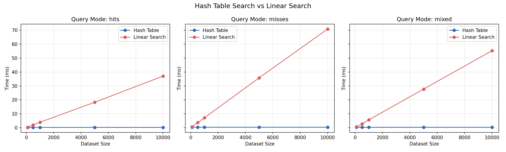
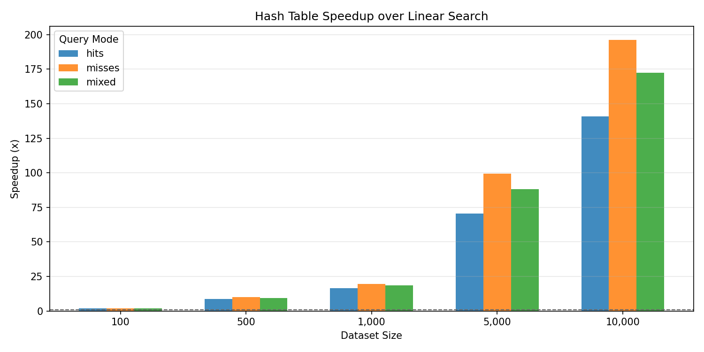
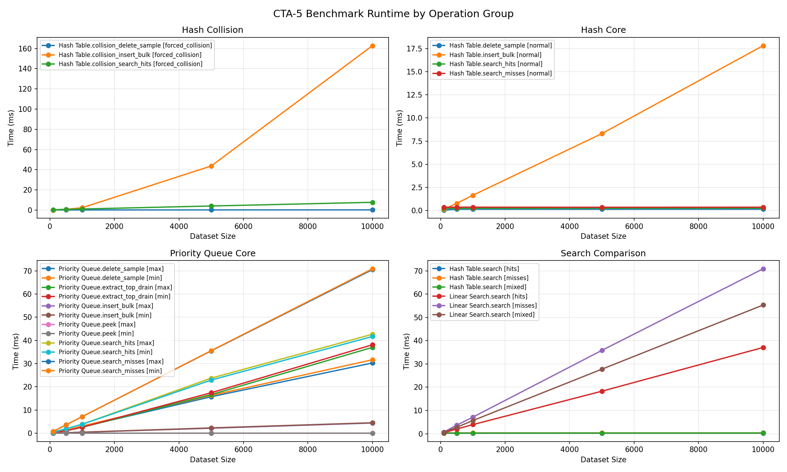
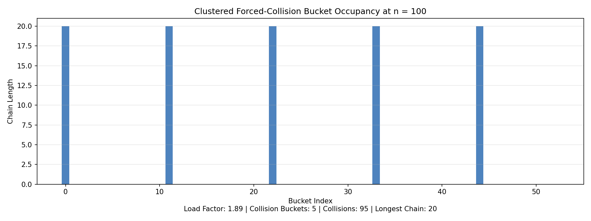

# Data Structure Performance Analysis

## Overview

Hash tables and priority queues are important in computer science because they solve different kinds of retrieval problems. A hash table is used when the main goal is fast key-based lookup. A priority queue is used when the main goal is to repeatedly remove the highest-priority or lowest-priority item. In this project, two structures were implemented and tested: `HashTable` and `BinaryHeapPriorityQueue`.

The purpose of this analysis is to examine how each structure behaves both theoretically and practically. Theoretical analysis uses Big-O notation to describe how performance grows as input size `n` increases. Practical analysis uses benchmark results collected from the CTA-5 Benchmark Lab across four workload groups: normal hash-table operations, forced-collision hash-table operations, priority-queue operations, and hash-table-versus-linear-search comparison. The benchmark sizes used in the generated report are `100`, `500`, `1,000`, `5,000`, and `10,000` items, which makes it possible to observe how quickly the performance differences widen as the workload becomes larger.

It is important to note that the same data structure idea can behave very differently depending on how it is implemented. Hash tables depend heavily on the quality of the hashing function and the collision strategy, while heaps depend on maintaining parent-child ordering in a nearly complete binary tree (CSU Global, n.d.; Lyseck & Vahid, 2020.). The benchmark results in this project support that point clearly. In particular, the results show how strongly hash distribution, collision buildup, and full linear scans influence real performance.

---

## Hash Table

A hash table stores data as key-value pairs and uses a hash function to map each key to a bucket in an array. The hash-table reference explains that this kind of structure stores data in an associative way and can provide very fast insertion and search when the index is computed effectively (Tutorials Point, n.d.-a). TIn other words, they compute a bucket index from each key, allowing the structure to have an average-case search of `O(1)`, that is, when the table is well designed (Lyseck & Vahid, 2020). In this project, the table is implemented as a bucket array where each bucket stores a Python list of `HashEntry` objects.

From a Big-O perspective, the hash table is the most favorable lookup structure in the project under normal conditions. Insert, search, and delete are all average-case `O(1)` operations because the workload usually only needs to inspect one bucket and a short chain. The worst case is still `O(n)` because too many keys can land in the same bucket and force a much longer scan. That average-case versus worst-case difference is one of the central ideas of hashing.

In practice, the normal hash-table benchmark results are very strong. `Hash Table.search_hits` grows only from `0.2214 ms` at `100` items to `0.2612 ms` at `10,000` items. `Hash Table.search_misses` grows only from `0.3451 ms` to `0.3525 ms` over the same range. `Hash Table.insert_bulk` increases from `0.1395 ms` at `100` items to `16.4633 ms` at `10,000` items, which is larger growth than search but still very favorable for a dynamic key-value structure. These results show that the hash table is an excellent choice when the workload depends on repeated key lookup.

---

## Hash Function Choice and Collision Resolution

The hash function in this project uses a position-weighted multiply-and-add design followed by modulo compression:

```text
h = 0
for each character ch in key:
    h = h * 31 + ord(ch)
bucket_index = h % capacity
```

The lecture notes explain why this kind of weighting matters. A simple sum of character codes can produce the same value for reordered strings, while a weighted approach helps distinguish keys that contain the same letters in a different order (CSU Global, n.d.). That is why a position-sensitive method was a better choice for this project than a plain character sum. The modulo step then compresses the hash code into a valid bucket index.

This is not a perfect hash function, and it is not intended to be. The Module 5 materials explain that practical hashing usually accepts the possibility of collisions and then resolves them with a collision strategy rather than trying to guarantee a unique value for every possible string (CSU Global, 2020). In this project, the collision strategy is **separate chaining**. When two keys map to the same bucket, both entries remain in that bucket's chain instead of competing for one array position.

The benchmark results show why both the hash function and the collision strategy matter. At `10,000` items, the normal `insert_bulk` workload finishes in `16.4633 ms`, while the forced-collision `collision_insert_bulk` workload requires `750.5403 ms`, which is about `45.6x` slower. The same pattern appears in search. Normal `search_hits` at `10,000` items finishes in `0.2612 ms`, while `collision_search_hits` requires `36.4424 ms`, which is about `139.5x` slower. These results make it clear that separate chaining preserves correctness, but no collision strategy can fully remove the cost of very poor bucket distribution.

---

## Priority Queue

A priority queue removes items according to priority rather than insertion order. The heap reference explains that a heap is a nearly complete binary tree and that the root can represent either the maximum value or the minimum value, depending on whether the structure is a max-heap or min-heap (Tutorials Point, n.d.-b). In other words, max-heaps and min-heaps as structures that preserve a simple parent-child ordering rule while keeping the highest- or lowest-priority item at the root (Lyseck & Vahid, 2020). In this project, the priority queue is implemented as a binary heap stored in a Python list and supports both max-heap and min-heap modes.

From a Big-O perspective, the priority queue has a more mixed performance profile than the hash table. Insert and `extract_top` are `O(log n)` because the heap only needs to restore order along one path of the tree. `peek` remains `O(1)` because it only reads the root element. However, search-by-label and delete-by-label are `O(n)` because the heap property does not provide a direct way to locate an arbitrary item by its label.

In practice, the benchmark results strongly support that description. At `10,000` items, `insert_bulk` takes `4.3354 ms` in max-heap mode and `4.4105 ms` in min-heap mode. `peek` remains effectively constant at `0.000034 ms` in both modes. In contrast, `search_hits` takes `42.2276 ms` in max-heap mode and `41.4176 ms` in min-heap mode, while `search_misses` rises to about `70.2 ms` in both modes. These results show that the priority queue is very effective when the workload needs root access, but much less effective when the workload needs general label lookup.

---

## Comparative Big-O Analysis

Big-O notation is useful in this project because it explains why the relative rankings in the benchmark data are not accidental. A well-distributed hash table can support average-case `O(1)` lookup, while a heap supports efficient root access but does not support direct arbitrary search (CSU Global, n.d.; Lyseck & Vahid, 2020). Those same ideas appear in this project's benchmark results. Operations that use direct bucket access or root access stay fast, while operations that force chain scans or full heap scans become much more expensive as `n` grows.

**Table 1**  
*Theoretical Complexity Comparison of the Data Structures in This Project*

| Structure      | Insert | Search | Delete | Peek / Extract | Key implementation note |
|----------------|--------|--------|--------|----------------|-------------------------|
| Hash Table     | `Avg O(1)`, worst `O(n)` | `Avg O(1)`, worst `O(n)` | `Avg O(1)`, worst `O(n)` | Not applicable | Uses a position-weighted string hash with separate chaining and resizing |
| Priority Queue | `O(log n)` | `O(n)` by label | `O(n) + O(log n)` by label | `peek: O(1)`, `extract_top: O(log n)` | Uses an array-backed binary heap in max or min mode |
| Linear Search  | Not applicable | `O(n)` | Not applicable | Not applicable | Scans the dataset from left to right until the key is found or exhausted |

*Note*: The table reflects the specific implementations used in this project, not every possible implementation of hash tables or heaps.

Table 1 illustrates the scaling patterns shown in the Benchmark Lab results. `Hash Table.search (hits)` grows only `1.18x` from `100` to `10,000`, and `Hash Table.search (misses)` grows only `1.02x`. `Priority Queue.peek` remains exactly `1.00x`, which is effectively constant. On the other hand, `Linear Search.search (misses)` grows `96.64x`, `Priority Queue.search_hits` in max-heap mode grows `103.64x`, and `Hash Table.collision_insert_bulk` grows `4,797.07x`. These very different growth rates are exactly what should be expected when one workload benefits from direct access while another workload is forced into repeated scans or collision-heavy behavior.

---

## Benchmark Results

The benchmark lab feature measured runtime for every major workload at sizes `100`, `500`, `1,000`, `5,000`, and `10,000`.

### Workload Groups

- Hash Core is the normal hash-table workload group that measures bulk insert, hit search, miss search, and sample delete on well-distributed data.
- Hash Collision is the forced-collision workload group that measures what happens when many keys are pushed into a small set of hot buckets.
- Priority Queue Core is the heap workload group that measures insert, peek, extract-top, hit search, miss search, and sample delete in both max-heap and min-heap modes.
- Search Comparison is the assignment-required performance comparison between hash-table search and linear search on the same query sets.

**Table 2**  
*Benchmark Results for All Workloads*

{{BENCHMARK_RESULTS_TABLE}}

*Note*: The table above is populated from the Benchmark Lab results saved in `analysis/benchmark_results.csv`.

**Table 3**  
*Hash Table Search Speedup over Linear Search*

{{SPEEDUP_SUMMARY_TABLE}}

*Note*: The speedup summary is populated from `analysis/search_speedup_summary.csv`.

**Table 4**  
*Operation Scaling Summary*

{{OPERATION_SCALING_TABLE}}

*Note*: The scaling summary is populated from `analysis/operation_scaling_summary.csv`.

**Figure 1**  
*Hash Table vs. linear search runtime*



*Note*: The chart makes the main assignment result easy to see. Hash-table search stays almost flat while linear search grows sharply as size increases.

**Figure 2**  
*Search speedup summary*



*Note*: The speedup chart highlights how much larger the hashing advantage becomes as the dataset grows, especially for misses and mixed-query workloads.

**Figure 3**  
*Benchmark runtime overview*



*Note*: The runtime overview brings the major CTA-5 workloads together in one figure and highlights the contrast between normal hashing, collision-heavy hashing, and heap workloads.

**Figure 4**  
*Collision distribution*



*Note*: The collision chart makes it easier to see how strongly the forced-collision inputs concentrate work into a small set of bucket chains.

The benchmark results show that the hash table is the strongest lookup structure in the project when the key distribution is healthy. At `10,000` items, `Hash Table.search` finishes in `0.2616 ms` for hits, `0.3534 ms` for misses, and `0.3125 ms` for mixed queries. Over the same workload sizes and query modes, `Linear Search.search` requires `36.4574 ms`, `70.2530 ms`, and `54.5457 ms`. This means the hash table is `139.35x` faster for hits, `198.79x` faster for misses, and `174.54x` faster for mixed queries at the largest tested size. That widening gap is exactly what Big-O analysis predicts.

The collision-specific results are also very important because they separate normal hashing from worst-case hashing. At `10,000` items, normal `search_hits` takes only `0.2612 ms`, but forced-collision `collision_search_hits` requires `36.4424 ms`. Normal `insert_bulk` finishes in `16.4633 ms`, but forced-collision `collision_insert_bulk` requires `750.5403 ms`. These results show that a hash table can be extremely fast, but only if the hash function and collision distribution remain favorable.

The priority-queue results show a different kind of tradeoff. `peek` stays effectively constant, `insert_bulk` remains relatively small, and `extract_top` grows in a predictable heap-like way. However, label-based search and delete are much more expensive because they still need to inspect items one by one. At `10,000` items, `peek` remains `0.000034 ms`, `insert_bulk` stays near `4.3` to `4.4 ms`, `extract_top_drain` grows to about `36` to `37 ms`, and `search_misses` grows to about `70.2 ms`. These results show that the heap is excellent for top-priority access, but not for arbitrary lookup.

---

## Conclusion

The results of this project show that the chosen implementations behave the way algorithm analysis predicts. The custom hash table performs very well on normal data because the hash function distributes keys well enough for average-case `O(1)` lookup, and the separate-chaining strategy preserves correctness when collisions occur. At the same time, the forced-collision benchmark demonstrates the main limitation of hashing: when too many keys cluster into only a few buckets, performance moves toward the `O(n)` worst case even though the data structure still works correctly.

The binary-heap priority queue also behaves as expected. It is very efficient when the workload matches the heap property, especially for `peek` and `extract_top`, but it is much less efficient for arbitrary label lookups because the heap does not provide a direct search path. Taken together, the results reinforce the central lesson of the assignment: choosing the right data structure depends on the kind of access the problem needs. For key-based lookup, the hash table is the best choice in this project. For repeated highest-priority or lowest-priority removal, the priority queue is the better fit.

## References

CCSU Global. (n.d.). Lecture 5: *Hash tables, heaps, and treaps* [Interactive lecture]. CSC506 - Design and Analysis of Algorithms. Canvas.

Lysecky, R., & Vahid, F. (2019).  Module 5: *Hash tables, heaps, and treaps*. Data structures essentials: Pseudocode with Python examples. zyBooks

Tutorials Point. (n.d.-a). *Hash table data structure*. Tutorials Point. https://www.tutorialspoint.com/data_structures_algorithms/hash_data_structure.htm

Tutorials Point. (n.d.-b). Heap sort algorithm. Tutorials Point.  https://www.tutorialspoint.com/data_structures_algorithms/heap_sort_algorithm.htm

