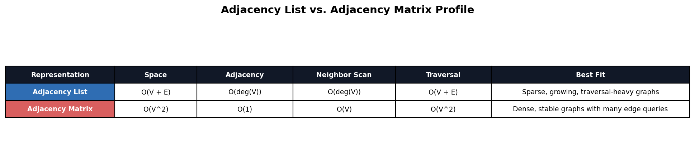
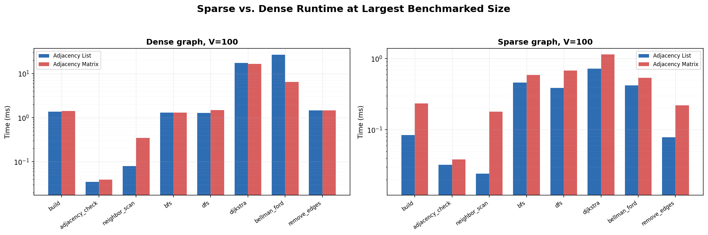
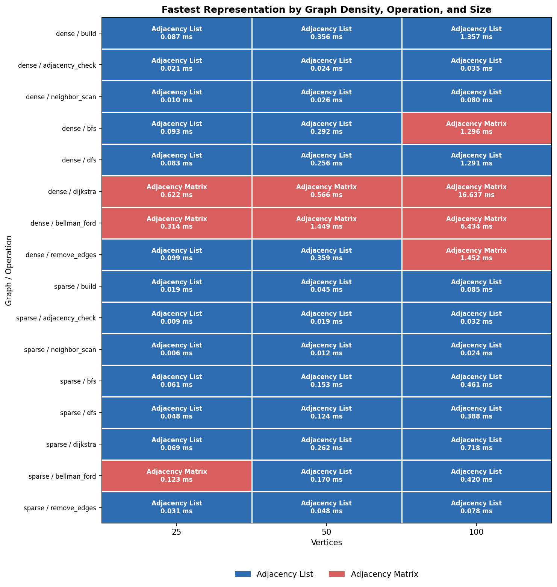

# Recommendation Guide: Choosing Graph Representations and Algorithms

## Overview

Choosing the right graph representation and algorithm depends on several
factors, not on speed only. When choosing between an adjacency-list graph and
an adjacency-matrix graph, it is important to consider whether the graph is
sparse or dense, whether repeated neighbor scans matter, whether direct edge
checks are common, whether the vertex set will remain stable, and whether the
shortest-path workload uses positive or negative edge weights. The Benchmark Lab compared `AdjacencyListGraph` and `AdjacencyMatrixGraph` across
`sparse` and `dense` scenarios with dataset sizes from `25` to `100`
vertices. Based on those benchmark results and the traversal and shortest-path
features in this module, this guide recommends when or in which instance each
representation and algorithm is the better practical fit.

---

## When to Use an Adjacency List

A list-based graph is the better choice when:

1. If the graph is sparse. An adjacency list is the better choice for this
   purpose because it stores real edges rather than reserving space for every
   possible vertex pair.

2. If the workload performs repeated neighbor scans, traversals, or route
   searches. `AdjacencyListGraph` is useful for this purpose because BFS, DFS,
   Dijkstra, and Bellman-Ford can move through stored neighbors directly.

3. If memory efficiency matters. In this kind of case, the list-based
   representation is preferable because its space cost follows `O(V + E)`
   rather than `O(V^2)`.

4. If the graph changes over time. A list-based graph is useful for this kind
   of problem because it organizes work around stored connections instead of a
   full square table.

It is important to note that the saved benchmark lab results strongly
support this recommendation under sparse workloads. In the saved sparse
scenarios, the adjacency list won all `24` operation-size buckets. At `100`
vertices, it was still faster for build, adjacency checks, neighbor scans,
BFS, DFS, Dijkstra, Bellman-Ford, and edge removal.

Example: Suppose a program models course prerequisites or road connections in
which each vertex links to only a small number of other vertices. An adjacency
list is useful for this kind of problem because the program can store only the
real connections and traverse those connections directly.

---

## When to Use an Adjacency Matrix Instead of an Adjacency List

A matrix-based graph is the better choice when:

1. If many possible connections are present and the vertex set is relatively
   stable. In this kind of case, the row-column structure becomes more
   reasonable because many of the `O(V^2)` cells represent real edges.

2. If the program performs many direct edge-existence checks. An adjacency
   matrix works well for this purpose because it is designed around direct
   source-target lookup once row and column positions are known.

3. If the workload resembles the dense benchmark cases where the matrix
   becomes more competitive. In the benchmark lab, `AdjacencyMatrixGraph`
   earned selected wins in dense adjacency checks, DFS, Dijkstra, Bellman-Ford,
   and edge removal.

4. If a full table view makes the graph easier to inspect, explain, or teach.
   The matrix works well for this purpose because every possible vertex pair
   is visible in one structured layout.

It is important to note that an adjacency matrix is not automatically the best
choice for every dense graph. In the saved dense scenarios, the matrix won `6`
of `24` operation-size buckets, and the adjacency list still won `18`. These
results show that the matrix is a specialized choice rather than a general
replacement for the list-based model.

Example: Suppose a classroom demonstration needs to show whether many possible
vertex pairs are linked and the graph stays mostly fixed. An adjacency matrix
is useful for this kind of problem because the full connection table is easy
to inspect directly.

---

## When an Adjacency List Is the Stronger Default Choice

The list-based representation is the stronger default choice when:

1. If the graph contains far fewer real edges than possible vertex pairs. In
   this kind of case, the list avoids paying matrix cost for absent edges.

2. If the workload includes repeated traversal and neighbor scanning. The
   adjacency list is useful for this purpose because those operations follow
   stored connections instead of scanning absent-edge cells.

3. If the program needs one representation that remains competitive across
   build, mutation, traversal, and shortest-path work. `AdjacencyListGraph` is
   the better practical fit here because it remains broadly competitive across
   most saved benchmark categories.

4. If practical scalability matters more than direct-table symmetry. The list
   is useful for this purpose because its performance follows the real graph
   structure more closely.

It is important to note that saved benchmark results support this
recommendation very strongly under sparse workloads. At the largest saved
sparse size of
`100` vertices, `AdjacencyListGraph` completed neighbor scan in `0.0211 ms`
versus `0.1793 ms` for the matrix, Dijkstra in `0.5930 ms` versus `0.9978 ms`,
and edge removal in `0.0763 ms` versus `0.2282 ms`. These results show that
the list-backed representation is the better practical default when the graph
stores relatively few real connections.

Example: In a routing or prerequisite system, a list-based graph is the better
choice when the program must repeatedly move through and inspect the same sparse
graph structure. This is useful because the same representation supports those
operations without reserving a large table of absent edges.

---

## When an Adjacency Matrix Becomes More Competitive Than the List

A matrix-based graph becomes more competitive when:

1. If enough matrix cells represent real edges. Under that condition, the cost
   of the square table is easier to justify.

2. If direct pair-based access matters more than neighbor iteration. The
   matrix works well for this purpose because its design favors source-target
   lookup.

3. If the dense shortest-path or dense traversal workload follows the same
   pattern as the saved benchmark wins. In benchmark lab, the matrix won dense
   Dijkstra at `25` and `100` vertices, dense Bellman-Ford at `100` vertices,
   and dense DFS at `100` vertices.

4. If a fixed row-column view matters more than storage efficiency, the matrix
   can be the better practical fit even though it requires more storage.

It is important to note that the matrix becomes more competitive without
becoming dominant. At dense `100`, the matrix was faster for adjacency checks
(`0.0368 ms` versus `0.0413 ms`), DFS (`1.2629 ms` versus `1.4653 ms`),
Dijkstra (`16.2586 ms` versus `17.3360 ms`), and Bellman-Ford (`5.8276 ms`
versus `5.8555 ms`). However, the list-based representation still remained
faster for build, neighbor scan, BFS, and edge removal at the same size. These
results show that dense workloads narrow the gap, but they do not remove the
list-based model's broader practical advantage.

Example: Suppose a program analyzes a dense scheduling or communication graph
where many vertex pairs are linked and repeated pair lookup matters. In this
kind of case, a matrix-based graph may be the better choice because the
workload matches the structure's main strength more closely.

---

## When BFS Is the Better Choice

BFS fits best when:

1. If the problem cares about layers beginning at one start vertex. BFS is
   useful for this purpose because it moves outward one level at a time.

2. If an unweighted graph needs the fewest number of edges from one start
   vertex. In this kind of case, BFS is usually the better fit because it
   reaches nearer vertices before farther ones.

3. If the goal is to show layered reachability. Social-network levels, router
   hop counts, and dependency distance are all good fits for BFS.

It is important to note that, on sparse workloads, BFS is usually paired well
with a list-based graph. In the benchmark lab, the sparse `100`-vertex BFS
benchmark favored the adjacency list at `0.4673 ms` compared with `0.5863
ms` for the matrix. That result reflects the advantage of traversing stored
neighbors directly.

Example: Suppose a network tool needs to show which devices are one hop, two
hops, and three hops away from a starting router. BFS is useful for this kind
of problem because its traversal order naturally matches those layers.

---

## When DFS Is the Better Choice

DFS is the better choice when:

1. If the problem benefits from branch-by-branch exploration before
   backtracking. DFS is useful for this purpose because it follows one path as
   far as possible before returning to another path.

2. If the program needs connected-component style exploration or exhaustive
   path following. In this kind of case, DFS is useful because its stack-like
   behavior supports backtracking naturally.

3. If the problem involves dependency exploration, cycle-oriented reasoning,
   or branch-by-branch inspection. DFS is well suited for this purpose because
   it keeps attention on one path until that path is exhausted.

It is important to note that DFS and BFS can produce different visit orders on
the same graph. The better choice depends on the goal of the traversal, not
only on which runtime is smaller in one benchmark bucket. In dense `100`,
`AdjacencyMatrixGraph` did outperform the list for DFS, which shows that graph
density can change the representation result even when the traversal purpose
stays the same.

Example: Suppose a program explores task dependencies and needs to follow one
dependency chain deeply before returning to another branch. DFS is useful for
this kind of problem because it naturally supports deep branch exploration.

---

## When Dijkstra Is the Better Choice

Dijkstra is the better choice when:

1. If every edge weight is non-negative. Dijkstra is the better choice for
   this purpose because it assumes path costs do not decrease through negative
   edges.

2. If the graph represents distance, travel time, latency, or another
   positive cost. In this kind of case, Dijkstra is useful because it provides
   the practical shortest-path default for positive-weight graphs.

3. If the workload performs repeated shortest-path searches on positive-cost
   graphs. Dijkstra is the better practical fit here because it avoids the
   extra work of Bellman-Ford when negative-weight cases are not part of the
   problem.

It is important to note that Dijkstra should not be used on graphs with
negative edge weights. A faster Dijkstra benchmark is not useful if the graph
violates the algorithm's correctness rules. In labs, the positive weighted
demo and the dense benchmark comparisons are appropriate uses of Dijkstra
because those cases use non-negative costs.

Example: Suppose a route planner needs the shortest driving distance between
Denver and Vail, and every road distance is positive. Dijkstra is useful for
this kind of problem because the graph follows the non-negative weight rule.

---

## When Bellman-Ford Is the Better Choice

Bellman-Ford is the better choice when:

1. If negative-weight edges can appear. Bellman-Ford is the better choice for
   this purpose because it can handle cases that Dijkstra must reject.

2. If the program must detect reachable negative cycles. In this kind of case,
   Bellman-Ford is useful because it includes a correctness check that
   Dijkstra does not provide.

3. If the graph models discounts, credits, penalties, refunds, or reductions
   that can lower the running path cost. Bellman-Ford is useful for this kind
   of problem because those situations can create negative-weight edges.

It is important to note that Bellman-Ford is slower in Big-O terms, but that
additional cost becomes necessary when correctness requires support for
negative-weight edges or negative-cycle detection. Overall, Bellman-Ford
is the best-suited when the negative edge values are present; the
negative-cost demo in the lab is one such case.

Example: Suppose an order-processing graph includes discounts and credits that
reduce the total cost of a path. Bellman-Ford is useful for this kind of
problem because it can evaluate negative-cost edges safely.

---

## Representation Comparison Snapshot

The following table summarizes the adjacency-list-versus-adjacency-matrix
comparison shown in the CTA-7 Benchmark Lab.

| Criterion                | List-Based Graph                                    | Matrix-Based Graph                                  |
|--------------------------|-----------------------------------------------------|-----------------------------------------------------|
| Best use case            | Sparse or changing connection data                  | Dense, stable, pair-heavy graphs                    |
| Best practical condition | Traversal, neighbor scans, and memory matter        | Direct edge checks or selected dense workloads      |
| Main strength            | Stores only real edges with `O(V + E)` space        | Organized for direct row-column pair lookup         |
| Main weakness            | Not the theoretical first choice for full-table use | Requires `O(V^2)` space even for absent edges       |
| CTA-7 role               | Main default graph representation                   | Specialized comparison representation               |
| Strong benchmark result  | Won all `24` saved sparse buckets                   | Won `6` dense buckets, including dense Dijkstra     |

It is important to note that the practical recommendation changes based on the
density of the graph, dense or sparse, and the operations performed on it. For 
sparse graphs, the list-based representation is the clear default. For dense 
graphs, the matrix-based representation is better suited, and yet the list still 
wins most saved operation buckets overall.

---

## Algorithm Choice Snapshot

The following table summarizes the best practical fit for each graph
algorithm.

| Algorithm    | Best use case                          | Main condition or warning                          |
|--------------|----------------------------------------|----------------------------------------------------|
| BFS          | Layered reachability                   | Best for unweighted fewest-edge paths              |
| DFS          | Deep path following and backtracking   | Visit order differs from BFS                       |
| Dijkstra     | Positive weighted shortest paths       | Do not use when negative-weight edges can occur    |
| Bellman-Ford | Negative-weight paths or cycle detection | Slower, but handles cases Dijkstra cannot handle |

It is important to note that representation choice and algorithm choice are separate
decisions. The representation should fit the graph's shape and dominant
operations, and the algorithm should fit the practical goal and the edge-weight rules.

---

## Recommendation Figures

The following figures summarize the main recommendation results from the CTA-7
Benchmark Lab.

**Figure 1**  
*Representation profile comparison*

*Note*: The representation profile chart shows that the list-based
representation is the stronger general default, while the matrix-based
representation remains useful in selected dense workloads.

**Figure 2**  
*Sparse and dense runtime comparison*

*Note*: The sparse and dense comparison chart shows how graph density changes
the practical gap between the two representations.

**Figure 3**  
*Operation winner heatmap*

*Note*: The heatmap shows the adjacency list winning all saved sparse buckets
and most saved dense buckets, while the matrix-based representation still
earns selected wins in pair-heavy and dense shortest-path cases.

---

## Practical Summary

| Decision area            | Better choice      | Main reason                                                                     |
|--------------------------|--------------------|---------------------------------------------------------------------------------|
| Sparse graph storage     | List-Based Graph   | Stores only real edges and wins the saved sparse benchmarks                     |
| Dense stable graph view  | Matrix-Based Graph | More competitive when direct pair lookup and table layout matter                |
| Layered reachability     | BFS                | Moves outward one level at a time                                               |
| Deep path exploration    | DFS                | Follows one branch until it must backtrack                                      |
| Positive weighted routes | Dijkstra           | Best choice when edge weights are non-negative                                  |
| Negative weighted routes | Bellman-Ford       | Best choice when negative-weight edges or cycle detection are necessary         |

---

## Practical Recommendation

The analysis in this report shows that there is no single best graph choice. 
If the graph is sparse, is updated over time, or traversal and 
neighbor-based operations are performed often, the list-based representation 
is the better choice. On the other hand, if the graph is dense, stable, and 
edge-pair operations are the most frequent operation, the matrix-based 
representation is best suited.

For algorithms, the main recommendation is to choose correctness first and 
performance second. Use BFS for layered reachability, and DFS for deep path 
following. Use Dijkstra for non-negative weighted shortest paths, and Bellman-Ford 
when negative-weight edges or negative-cycle detection are part of the problem.
