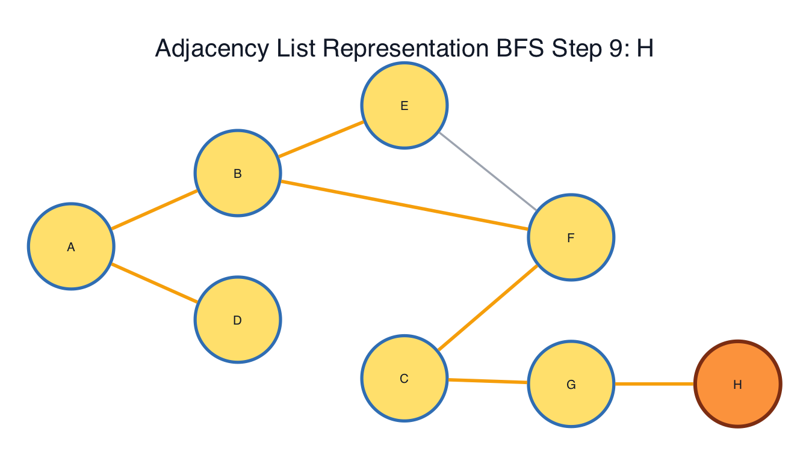
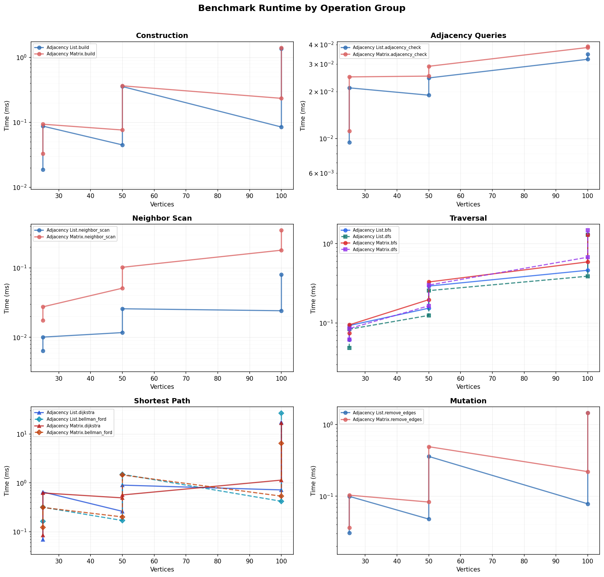

# Graph Representation and Algorithm Performance Analysis

## Overview

Graphs are important in computer science because they model relationships
between objects. A graph can describe roads between cities, links between
network devices, dependencies between tasks, or relationships between people.
In this project, two graph storage models are implemented and evaluated:
`AdjacencyListGraph` and `AdjacencyMatrixGraph`. The project also evaluates
four graph algorithms: breadth-first search (BFS), depth-first search (DFS),
Dijkstra's shortest-path algorithm, and Bellman-Ford.

The purpose of this analysis is to examine how each representation behaves
both theoretically and practically. Theoretical analysis uses Big-O notation to
describe how performance grows as the number of vertices `V` and edges `E`
increases. Practical analysis uses benchmark data collected from the Benchmark Lab
across sparse and dense graph workloads using vertex counts of
`25`, `50`, and `100`. The saved benchmark data compares construction,
adjacency checks, neighbor scans, BFS, DFS, Dijkstra, Bellman-Ford, and edge
removal.

It is important to note that representation choice depends strongly on the
workload. The list-based model records real neighbor relationships, which makes
it a good fit for sparse workloads. The matrix-based model allocates a
row-column position for each source-target pair; that design can help in
dense, stable workloads where direct edge checks are common (CSU Global, n.d.; 
Lysecky & Vahid, 2019). The benchmark results in this project support that point clearly. 
In particular, the results show how
strongly graph density influences the practical difference between list-based
and matrix-based storage.

---

## Adjacency List Representation

`AdjacencyListGraph` stores each vertex beside the vertices directly connected
to it. In this project, the list representation uses dictionary-backed
neighbor maps, which means a vertex only stores relationships that actually
exist. This structure fits sparse graphs because absent edges do not require a
stored source-target cell.

From a Big-O perspective, list-based graph storage uses `O(V + E)` space.
Traversal algorithms such as BFS and DFS also fit naturally with this
representation because each step uses the current vertex's stored neighbors.
On a sparse workload, that behavior avoids scanning many empty relationships.
This is why list-based representations are commonly recommended when edge
counts remain much lower than the maximum number of possible vertex pairs
(Lysecky & Vahid, 2019).

In practice, the saved benchmark results strongly favor list-based storage on
sparse workloads. At `100` vertices in the sparse workload, the list
implementation is faster for build, neighbor scan, BFS, DFS, Dijkstra,
Bellman-Ford, and edge removal. The only sparse `100`-vertex operation where
the matrix wins is direct adjacency checking, and even there the matrix
advantage is modest. These results show that list-based storage is the
strongest default for the kind of sparse relationship data that appears often
in real applications.

---

## Adjacency Matrix Representation

`AdjacencyMatrixGraph` stores graph connections in a square table. Each row and
column represents a vertex, and each cell records whether a source-target pair
has an edge. If the row and column are already known, an adjacency check can be
performed in `O(1)` time. That direct lookup is the main theoretical advantage
of the matrix representation (CSU Global, n.d.; Lysecky & Vahid, 2019).

The trade-off is space. A matrix uses `O(V^2)` storage because it must allocate
a cell for each source-target pair, even when most pairs do not have edges.
This makes matrix storage less attractive for sparse workloads. It becomes
more reasonable in dense workloads because a larger share of the allocated
cells contain useful edge information.

In practice, the matrix representation remains valuable in this project, but
it is more specialized than list-based storage. The saved dense benchmark
results show matrix wins for dense Dijkstra at all tested sizes. At `100`
vertices, dense Bellman-Ford also favors the matrix. Still, list-based storage
wins most dense operation buckets overall. This means the matrix should not be
treated as the automatic choice for every dense graph. It is most useful when
the workload has stable vertices, many direct pair checks, or a specific
shortest-path pattern in which matrix storage benchmarks better.

---

## Traversal and Shortest-Path Algorithms

BFS and DFS both explore reachable vertices, but they organize the search in
different ways. BFS expands outward from the start vertex in layers, while DFS
follows one path deeply before it backtracks (Colorado State University Global,
2020; Lysecky & Vahid, 2019). In this project, the Traversal Lab shows that the
same graph can produce different visit orders depending on whether the program
uses BFS or DFS.

**Figure 1**  
*Traversal Lab BFS result*

*Note*: This image marks the final BFS traversal result from the sample
traversal graph.

Shortest-path algorithms add a different kind of decision. Dijkstra is the
right practical default when every edge weight is non-negative. Bellman-Ford is
slower in Big-O terms, but it supports negative edge costs and can detect
reachable negative cycles (Rao & Murugan, 2019; Lysecky & Vahid, 2019). That
correctness distinction matters more than representation performance. A matrix
may be efficient for some dense shortest-path workloads, but it cannot make
Dijkstra valid on a graph containing negative costs.

The Shortest Path Lab examples show this difference clearly. On the positive
route demo, Dijkstra finds the Denver-to-Vail route
`Denver -> Boulder -> Vail` for a total distance of `139`. On the negative
cost demo, Bellman-Ford is the correct choice because discount and credit edges
reduce the running cost. The resulting path reaches `Order Complete` with a
total cost of `69`.

---

## Comparative Big-O Analysis

Big-O notation is useful in this project because it shows why the benchmark
rankings are not accidental. List-based storage scales with stored
relationships, while matrix storage scales with every possible source-target
pair. That difference becomes especially visible in sparse workloads.
Operations that only need real neighbors usually favor the list-based model,
while direct pair checks are the clearest theoretical strength of the matrix.

**Table 1**  
*Theoretical Complexity Summary for CTA-7 Graph Structures and Algorithms*

| Operation                | `AdjacencyListGraph`            | `AdjacencyMatrixGraph`  | Key implementation note                                                           |
|--------------------------|--------------------------------:|------------------------:|-----------------------------------------------------------------------------------|
| Space                    | `O(V + E)`                      | `O(V^2)`                | List storage follows real edges; matrix storage follows every source-target pair. |
| Build graph              | `O(V + E)`                      | `O(V^2 + E)`            | Matrix construction must prepare the square row-column structure.                 |
| Check adjacency          | `O(deg(V))` in the report model | `O(1)`                  | This implementation's dictionary-backed list keeps practical checks competitive.  |
| Scan neighbors           | `O(V + E)`                      | `O(V^2)`                | Matrix scans can inspect empty cells.                                             |
| BFS / DFS                | `O(V + E)`                      | `O(V^2)`                | Traversal requests each vertex's stored neighbors.                                |
| Dijkstra                 | `O((V + E) log V)`              | `O(V^2 log V)`          | Dijkstra benchmark inputs use positive edge values.                               |
| Bellman-Ford             | `O(VE)`                         | `O(VE)`                 | Bellman-Ford is slower but supports negative edge cases.                          |
| Remove edges             | `O(1)` average                  | `O(1)`                  | Both structures can remove a known edge directly in the current code.             |

*Note*: This table follows the implementations and benchmark labels used in
this project, not every possible graph design.

Table 1 helps explain the saved results. On sparse graphs, `E` is much smaller
than `V^2`; list storage therefore avoids a large amount of unused matrix work.
On dense graphs, `E` approaches `V^2`, narrowing the practical gap and creating
selected situations in which matrix storage can compete or win.

---

## Benchmark Findings

The Benchmark Lab measured list and matrix runtime using `25`, `50`, and `100`
vertices across sparse and dense graph workloads. The sparse workload becomes
less dense as the vertex count increases, while the dense workload keeps
density at `0.6000`.

**Table 2**  
*Saved Benchmark Workloads*

| Graph kind | Vertices | Edges | Density |
|------------|----------|-------|---------|
| Sparse     | 25       | 30    | 0.1000  |
| Sparse     | 50       | 61    | 0.0498  |
| Sparse     | 100      | 124   | 0.0251  |
| Dense      | 25       | 180   | 0.6000  |
| Dense      | 50       | 735   | 0.6000  |
| Dense      | 100      | 2,970 | 0.6000  |

*Note*: The benchmark workload summary is populated from
`analysis/benchmark_results.csv`.

**Table 3**  
*Operation Winner Summary*

| Graph kind | `AdjacencyListGraph` winner buckets | `AdjacencyMatrixGraph` winner buckets | Interpretation                                                                         |
|------------|-------------------------------------|---------------------------------------|----------------------------------------------------------------------------------------|
| Sparse     | 23                                  | 1                                     | The list-backed model is the clear default because absent edges dominate.              |
| Dense      | 19                                  | 5                                     | The matrix becomes competitive, while list-backed storage remains the broader default. |

*Note*: The winner summary is populated from
`analysis/operation_winners.csv`.

**Table 4**  
*Largest Saved Sparse Workload at 100 Vertices*

| Operation          | Fastest structure      | Fastest time (ms) | Runner-up              | Winner gap |
|--------------------|------------------------|------------------:|------------------------|---------:|
| Build graph        | `AdjacencyListGraph`   | 0.0724            | `AdjacencyMatrixGraph` | 69.2%    |
| Check adjacency    | `AdjacencyMatrixGraph` | 0.0382            | `AdjacencyListGraph`   | 8.5%     |
| Scan neighbors     | `AdjacencyListGraph`   | 0.0237            | `AdjacencyMatrixGraph` | 85.4%    |
| BFS                | `AdjacencyListGraph`   | 0.4662            | `AdjacencyMatrixGraph` | 24.1%    |
| DFS                | `AdjacencyListGraph`   | 0.3995            | `AdjacencyMatrixGraph` | 37.2%    |
| Dijkstra           | `AdjacencyListGraph`   | 0.6392            | `AdjacencyMatrixGraph` | 35.5%    |
| Bellman-Ford       | `AdjacencyListGraph`   | 0.4678            | `AdjacencyMatrixGraph` | 14.8%    |
| Remove edges       | `AdjacencyListGraph`   | 0.0797            | `AdjacencyMatrixGraph` | 63.3%    |

*Note*: The sparse `100`-vertex results show list-backed storage holding its
largest practical advantage.

**Table 5**  
*Largest Saved Dense Workload at 100 Vertices*

| Operation          | Fastest structure      | Fastest time (ms) | Runner-up              | Winner gap |
|--------------------|------------------------|------------------:|------------------------|-----------:|
| Build graph        | `AdjacencyListGraph`   | 1.3605            | `AdjacencyMatrixGraph` | 4.3%       |
| Check adjacency    | `AdjacencyListGraph`   | 0.0351            | `AdjacencyMatrixGraph` | 7.5%       |
| Scan neighbors     | `AdjacencyListGraph`   | 0.0753            | `AdjacencyMatrixGraph` | 78.7%      |
| BFS                | `AdjacencyListGraph`   | 1.1333            | `AdjacencyMatrixGraph` | 1.4%       |
| DFS                | `AdjacencyListGraph`   | 1.2648            | `AdjacencyMatrixGraph` | 2.3%       |
| Dijkstra           | `AdjacencyMatrixGraph` | 16.5533           | `AdjacencyListGraph`   | 4.4%       |
| Bellman-Ford       | `AdjacencyMatrixGraph` | 6.0751            | `AdjacencyListGraph`   | 77.5%      |
| Remove edges       | `AdjacencyListGraph`   | 1.3623            | `AdjacencyMatrixGraph` | 5.7%       |

*Note*: The dense `100`-vertex results show why the matrix implementation
should remain available even though list-backed storage wins more total
operations.

**Figure 2**  
*Representation profile comparison*

*Note*: The chart summarizes how the two graph representations compare across
major operation groups.

**Figure 3**  
*Runtime by operation group*

*Note*: The chart makes traversal and shortest-path costs easier to compare.

**Figure 4**  
*Sparse and dense runtime comparison*

*Note*: The chart shows how graph density changes the practical gap between
list-based and matrix-based storage.

**Figure 5**  
*Operation winner heatmap*

*Note*: The heatmap shows list-based storage winning most saved benchmark
buckets, while the matrix still earns meaningful wins in selected dense
shortest-path workloads.

Overall, the benchmarks identify list-based storage as the stronger general
representation in this project. In sparse workloads, it wins `23` of `24`
operation-size buckets. At the largest sparse size, it is especially strong
for neighbor scanning, build time, and edge removal because it only works with
stored relationships.

Dense workloads tell a more detailed story: list-based storage still wins `19`
of `24` dense operation-size buckets, including build, neighbor scan, DFS, and
edge removal at `100` vertices. The matrix wins dense Dijkstra at all saved
sizes and dense Bellman-Ford at `100` vertices. These results show that high
density can push the matrix into stronger territory when the workload uses the
full vertex-pair structure.

Scaling also matters. In the dense workload, adjacency-list Bellman-Ford grows
from `0.2888 ms` at `25` vertices to `27.0049 ms` at `100` vertices, a
`93.50x` increase. Matrix Bellman-Ford grows from `0.3069 ms` to `6.0751 ms`
over the same sizes, a `19.79x` increase. Dijkstra grows sharply for both
representations because the dense workload presents a much larger edge set to
evaluate. This scaling evidence supports the central lesson of the module:
storage choice and operation mix jointly drive graph runtime.

---

## Where Graph Representations Help Most

List-based graphs help most when a program stores sparse relationship data,
changes the graph over time, or traverses repeatedly from vertex to vertex.
Examples include road maps, social networks, prerequisite graphs, router
connections, and dependency networks. In those cases, storing only real edges
keeps memory use lower and gives traversal algorithms direct access to the
neighbors that matter.

Matrix-based graphs help most for dense data, stable vertex sets, and workloads
that ask many direct pair questions. A matrix is also useful for teaching
because the table view makes each source-target pair visible. The cost is that
empty relationships still occupy matrix space, making matrix storage harder to
justify for sparse workloads.

Algorithm choice is a separate decision. For example, BFS is used for tasks that
require layered reachability or the smallest edge count in unweighted settings.
DFS is used for deep exploration with later backtracking. Dijkstra is used for
non-negative shortest paths. Bellman-Ford is used for negative costs or
negative-cycle detection. A correct graph workflow matches the representation
to the data and matches the algorithm to the graph's weight rules.

---

## Conclusion

The results of this project show that the implemented graph structures behave
the way algorithm analysis predicts. List-based storage performs well because
it stores actual relationships instead of allocating cells for every
source-target pair. Under sparse workloads, that advantage is clear across
nearly all operations. For that reason, list-based storage is the best default
representation for most applications.

At the same time, the adjacency matrix still matters. It supports direct pair
reasoning, gives a clear table-based view into graph connections, and wins
selected dense shortest-path workloads in the saved benchmarks. For that
reason, matrix storage is not a weaker version of list storage. It follows a
separate cost model.

The most important conclusion of this module is that graph performance is a
workload decision. Density, mutation pattern, adjacency-query frequency,
traversal needs, and edge-weight rules all affect the best choice. For sparse
data or graphs that change over time, list-based storage is usually stronger.
For dense, stable, pair-heavy data, matrix storage should be considered and
benchmarked. When negative costs may occur, Bellman-Ford must be chosen first
to preserve correctness; representation tuning comes afterward.

## References

CSU Global. (n.d.). *Lecture 7: Graphs*. CSC506: Design
and Analysis of Algorithms. Canvas.

Rao, K. P. K., & Murugan, T. S. (2019). An efficient routing algorithm for
software defined networking using Bellman Ford algorithm. *International
Journal of Online Engineering, 15*(14), 87-95.
https://doi.org/10.3991/ijoe.v15i14.11546

Lysecky, R., & Vahid, F. (2019). Module 7: Graphs. *Data structures
essentials: Pseudocode with Python examples*. zyBooks.
