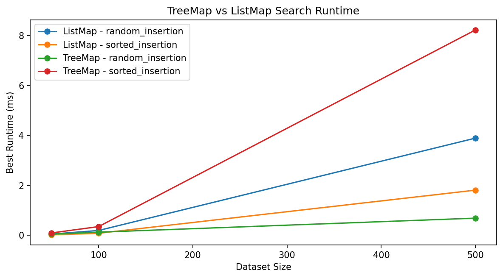
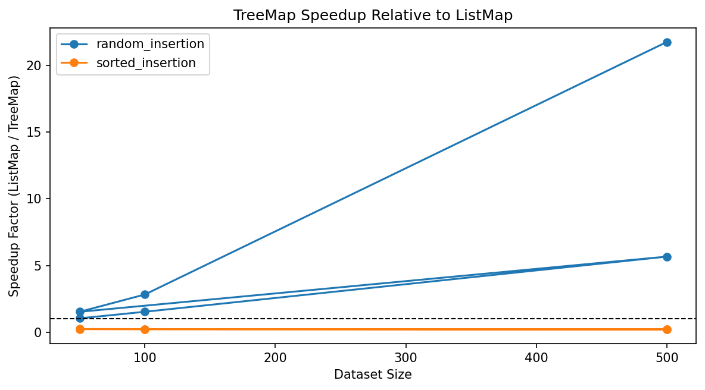
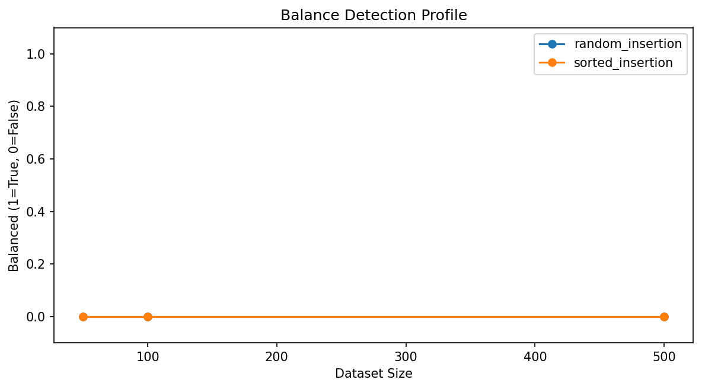

# Recommendation Guide: Choosing Between TreeMap and ListMap

## Overview

Choosing the right key-value lookup approach depends on several factors, not on
speed only. When choosing between a BST-backed `TreeMap` and a list-backed
`ListMap`, it is important to consider whether repeated lookup matters, whether
keys need to remain ordered, whether minimum and maximum lookup are useful, how
tree height will change as items are inserted, and how the cost changes as the
dataset becomes larger. The Module 6 Benchmark Lab compared `TreeMap` search
against `ListMap` search across `random_insertion` and `sorted_insertion`
scenarios. The saved dataset sizes ranged from `50` to `500`. Based on those
benchmark results and the balance-detection feature, this guide recommends when
or in which instance each approach is best suited.

---

## When to Use TreeMap

`TreeMap` is the better choice when:

1. If the workload performs repeated key lookups on the same dataset. `TreeMap`
   is the better choice for this purpose because it can use tree ordering to
   narrow the search path instead of scanning every pair one by one.

2. If the program needs keys to remain logically ordered. `TreeMap` is well
   suited for this purpose because in-order traversal returns keys in sorted
   order.

3. If the program needs direct support for minimum key and maximum key lookup.
   `TreeMap` is useful for this purpose because those operations follow the
   leftmost and rightmost paths of the tree.

4. If insertion order is likely to keep the tree relatively short. In this kind
   of case, `TreeMap` is the better choice because its search cost depends on
   tree height rather than only on the total number of stored items.

It is important to note that `TreeMap` is not automatically the best choice in
every case. In this project, `TreeMap` performs very well when the tree stays
relatively short, but it becomes much weaker when sorted insertions create a
severely skewed plain BST.

Example: Suppose a program stores student records by student ID and must later
display those records in sorted order while also supporting repeated lookup by
ID. `TreeMap` is useful for this kind of problem because one structure supports
both searching and ordered output.

---

## When to Use ListMap Instead of TreeMap

`ListMap` is the better choice when:

1. If the dataset is very small. `ListMap` is acceptable for this purpose
   because a short linear scan may still be simple and fast enough in absolute
   time.

2. If only one or two searches will ever be performed. In that case, the added
   structure of a tree-backed map may not be necessary.

3. If insertion order matters more than sorted key order. `ListMap` is useful
   for this purpose because it preserves the stored sequence directly rather
   than reordering keys by BST comparisons.

4. If the workload is at high risk of producing a severely skewed plain BST.
   In this kind of case, `ListMap` may be the better choice because its
   performance is predictable and does not depend on tree shape.

It is important to note that `ListMap` is simpler, but simplicity does not mean
better scalability. The Module 6 benchmark results show that `ListMap` only
becomes the better practical choice when the plain BST loses its shape
advantage.

Example: Suppose a program stores a very small temporary list of recent items
and only searches it once in a while. `ListMap` is useful for this kind of
problem because a simple direct scan may be enough.

---

## When a Plain BST-Based Map Is a Strong Choice

A plain BST-backed map is the better choice when:

1. If insertions are distributed in a way that keeps the tree much shorter than
   the dataset itself. In Module 6, the `random_insertion` scenario fits this
   pattern.

2. If the workload includes many misses. `TreeMap` is useful for this purpose
   because a relatively short search path can still fail much faster than a
   full linear scan.

3. If the program needs both ordered traversal and repeated search. `TreeMap`
   is the better choice for this purpose because `ListMap` does not provide
   sorted traversal as part of its basic search model.

4. If the goal is to combine map-style lookup with tree-based analysis of
   height and balance. This module is well suited for that purpose because the
   project explicitly reports tree height and balance status after benchmark
   runs.

It is important to note that the benchmark results strongly support this
recommendation under `random_insertion`. At `50` items, `TreeMap` was already
slightly faster for hits and about `1.53x` faster for misses. At `500` items,
the gap widened much more. `TreeMap` became `5.66x` faster for hits and
`21.74x` faster for misses. Over the same sizes, tree height grew only from `7`
to `19`, which helps explain why the tree-based map remained effective.

Example: In a course-registration system, a tree-backed map is the better
choice when records must be searched repeatedly by student ID and later listed
in sorted order. This is useful because the same structure supports both tasks.

---

## When TreeMap Becomes Weaker Than ListMap

`TreeMap` becomes the weaker choice when:

1. If insertions arrive in sorted order. This is risky in a plain BST because
   the structure can become almost a one-branch chain.

2. If tree height grows almost one-for-one with dataset size. In that case, the
   search path becomes much longer and the tree loses its main advantage.

3. If misses are common in a skewed tree. In this kind of case, the search may
   still need to walk a long path before reporting failure.

4. If the workload does not need sorted traversal strongly enough to justify
   the tree-shape risk.

It is important to note that the `sorted_insertion` benchmark results make this
problem very clear. At `500` items, the sorted tree reached a height of `499`,
while the random-insertion tree reached a height of only `19`. That shape
difference appeared directly in runtime. For hit queries at `500` items,
`TreeMap` required `8.2306 ms` while `ListMap` required only `1.8111 ms`. For
miss queries, `TreeMap` required `16.0256 ms` while `ListMap` required only
`3.5021 ms`. These results show that a plain BST can degrade so badly that the
list-backed baseline becomes the better practical choice.

Example: Suppose new keys always arrive in already sorted order, such as
consecutive IDs inserted from smallest to largest. In this kind of case, a
plain BST-backed map is a weak choice because the tree can become heavily
skewed.

---

## Search Comparison Snapshot

The following table summarizes the TreeMap-versus-ListMap search comparison
shown in the Module 6 Benchmark Lab.

{{SEARCH_SPEEDUP_TABLE}}

It is important to note that the practical recommendation changes with
insertion pattern. Under `random_insertion`, the speedup values grow above
`1.00x`, which means `TreeMap` is faster than `ListMap`. Under
`sorted_insertion`, the values fall well below `1.00x`, which means `TreeMap`
is actually slower than the list-backed baseline.

---

## Balance Snapshot

The following table summarizes how tree height changed across the saved
benchmark scenarios.

{{BALANCE_SUMMARY_TABLE}}

It is important to note that both saved scenarios are marked as not balanced by
the strict balance rule. However, the benchmark results show that these cases
are still not equally healthy. The random-insertion trees remain much shorter,
while the sorted-insertion trees become severely skewed.

---

## Recommendation Figures

The following figures summarize the main recommendation results from the Module
6 Benchmark Lab.

**Figure 1**  
*TreeMap vs. ListMap search runtime*

*Note*: The runtime chart shows that `TreeMap` performs well when insertion
order keeps the BST relatively short, but performs poorly when sorted
insertions create a skewed tree.

**Figure 2**  
*Search speedup summary*

*Note*: The speedup chart shows that `TreeMap` gains a practical advantage only
when the BST shape remains favorable.

**Figure 3**  
*Balance detection profile*

*Note*: The balance chart shows that strict balance detection marks both saved
scenarios as unbalanced, even though the random trees remain much healthier
than the sorted trees in practice.

---

## Practical Summary

| Criterion                | TreeMap                                             | ListMap                                        |
|--------------------------|-----------------------------------------------------|------------------------------------------------|
| Best use case            | Repeated lookup with ordered keys                   | Small or simple key-value storage              |
| Best practical condition | Tree stays relatively short                         | Dataset remains small or skew risk is high     |
| Main strength            | Search plus sorted traversal in one structure       | Simplicity and predictable linear behavior     |
| Main weakness            | Can degrade badly when the plain BST becomes skewed | Search always grows linearly with dataset size |
| Module 6 role            | Main tree-based map under study                     | Baseline comparison structure                  |
| Strong benchmark result | Faster under `random_insertion`                      | Faster under `sorted_insertion`                |

---

## Key Takeaway

In practice, there is no single best map choice for every situation. If the
program needs repeated key lookup, sorted key output, and minimum or maximum
support, `TreeMap` is the better choice when insertion order keeps the tree
relatively short. If the dataset is very small, or if insertion order is likely
to create a severely skewed plain BST, `ListMap` is the better choice because
its behavior remains simple and predictable.

Based on Benchmark Lab results and the balance-detection feature, the most
practical recommendation in this project is to use `TreeMap` when the workload
benefits from ordered searching and the tree shape remains healthy enough to
preserve that advantage. Use `ListMap` when simplicity matters more than
ordering, or when the insertion pattern is likely to make the plain BST lose
its performance benefit.
