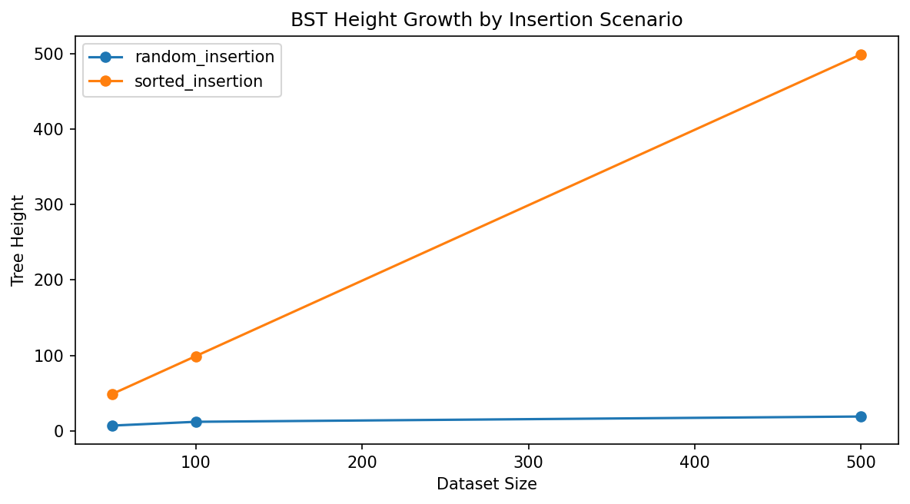

# Data Structure Performance Analysis

## Overview

Binary search trees are important in computer science because they support both
key-based search and ordered traversal within the same structure. A plain
Binary Search Tree (BST) is useful when a program needs faster-than-linear
lookup while also preserving sorted relationships between keys. In this
project, three related components are implemented and evaluated:
`BinarySearchTree`, a BST-backed `Map` called `TreeMap`, and a list-backed
`ListMap` baseline used for search comparison.

The purpose of this analysis is to examine how each structure behaves both
theoretically and practically. Theoretical analysis uses Big-O notation to
describe how performance grows as input size `n` increases. Practical analysis
uses benchmark results collected from the Module 6 Benchmark Lab across two
insertion scenarios, `random_insertion` and `sorted_insertion`, and two query
modes, `hits` and `misses`. The saved benchmark sizes used in the generated
report are `50`, `100`, and `500` items, which is enough to show how strongly
tree height influences search performance.

It is important to note that the same BST idea can behave very differently
depending on insertion order. When keys are inserted in a way that keeps the
tree relatively short, search only follows a limited root-to-leaf path. When
keys are inserted in sorted order, the same plain BST can become heavily
skewed and behave much more like a linked list (CSU Global, n.d.; Tutorials
Point, n.d.-a). More broadly, tree data structures are useful because they
organize information hierarchically while still supporting targeted navigation
through parent-child relationships (Tutorials Point, n.d.-b). The benchmark
results in this project support that point clearly. In particular, the results
show how strongly tree height and skew influence real performance.

---

## Binary Search Tree

A binary search tree stores each key according to an ordering rule. Keys in the
left subtree compare smaller than the current node, and keys in the right
subtree compare larger. That ordered structure makes searching natural and it
also makes in-order traversal return keys in sorted order (CSU Global, n.d.;
Tutorials Point, n.d.-a). In this project, the BST implementation supports
insert, search, delete, minimum, maximum, and the three required traversals:
in-order, pre-order, and post-order.

Deletion is the most complex BST operation because it must preserve the BST
ordering rule. The implementation handles the standard cases for deleting a
leaf node, deleting a node with one child, and deleting a node with two
children. In the two-child case, the deleted node is replaced with its
in-order successor so the ordering property remains valid (CSU Global, n.d.).
The same ordered structure also makes minimum and maximum lookup
straightforward, because the minimum key is found by following the leftmost
path and the maximum key is found by following the rightmost path.

From a Big-O perspective, the plain BST has two very different performance
profiles. Insert, search, delete, minimum, and maximum are all `O(h)`, where
`h` is the height of the tree. When the tree remains relatively short, that
behavior is typically close to `O(log n)`. The worst case is still `O(n)`
because a plain BST can become severely skewed. Traversals remain `O(n)`
because they must visit every node. That height-dependent difference is one of
the central ideas of this project.

In practice, the saved balance results make that point easy to see. Under
`random_insertion`, tree height grows from `7` at `50` items to `19` at `500`
items. Under `sorted_insertion`, tree height grows from `49` at `50` items to
`499` at `500` items, which is nearly a one-branch chain. These results show
that a BST is not just defined by its ordering rule. Its real performance also
depends strongly on its shape.

---

## TreeMap and the ListMap Baseline

A map stores key-value pairs rather than standalone keys. In this project,
`TreeMap` uses the BST to store comparable keys with associated values, while
`ListMap` serves as a linear-search baseline. That comparison is important
because it shows when ordered tree navigation provides a real benefit over a
simple sequential scan.

From a Big-O perspective, `TreeMap.search` is `O(h)`, which can be close to
`O(log n)` when the tree stays relatively short but can degrade to `O(n)` when
the tree becomes skewed. `ListMap.search` is consistently `O(n)` because it
must inspect stored pairs from left to right until a match is found or the list
is exhausted. `TreeMap` also supports minimum key, maximum key, and sorted
traversal naturally through the BST structure, while `ListMap` does not
provide those ordered operations as part of its basic search model.

In practice, the random-insertion results strongly favor `TreeMap`. At `500`
items, `TreeMap` needs `0.6878 ms` for hit queries and `0.2351 ms` for miss
queries, while `ListMap` requires `3.8953 ms` and `5.1100 ms` for the same
workloads. This means `TreeMap` is `5.66x` faster for hits and `21.74x` faster
for misses at the largest saved random benchmark size. These results show that
a relatively short BST can outperform linear scanning by a wide margin.

The sorted-insertion results show the opposite pattern. At `500` items,
`TreeMap` needs `8.2306 ms` for hit queries and `16.0256 ms` for miss queries,
while `ListMap` requires only `1.8111 ms` and `3.5021 ms`. In other words,
`ListMap` becomes about `4.54x` faster for hits and `4.58x` faster for misses
once the plain BST becomes severely skewed. These results make it clear that a
tree-backed map is not automatically better than a list-backed one. The outcome
depends on tree height.

---

## Balance Detection and Tree Shape

The balance-detection system in this project does not rebalance the tree. Its
purpose is to measure when a plain BST has drifted far enough from a healthy
shape that performance expectations should change. This distinction matters
because the assignment is about evaluating standard BST behavior, not replacing
it with AVL rotations or another self-balancing design (CSU Global, n.d.).

The saved balance summary shows `is_balanced = False` for both insertion
scenarios at every tested size. However, those results should not be read as
meaning the random trees and sorted trees are equally poor. The important
difference is how far each tree drifts from an ideal shape. At `500` items, the
random tree height is only `19`, while the sorted tree height is `499`. In
other words, both scenarios fail the strict balance rule, but the random case
still remains much shorter and much more efficient in practice.

---

## Comparative Big-O Analysis

Big-O notation is useful in this project because it explains why the benchmark
rankings are not accidental. A shorter BST path can outperform a list scan, but
a highly skewed BST can lose that advantage and move toward linear behavior
(CSU Global, n.d.; Tutorials Point, n.d.-a). Those same ideas appear clearly in
the benchmark results. Operations that benefit from short tree height stay
fast, while operations forced through long root-to-leaf paths become much more
expensive as `n` grows.

**Table 1**  
*Theoretical Complexity Comparison of the Data Structures in This Project*

| Structure             | Insert                           | Search                           | Delete                           | Traversal / Min-Max                               | Key implementation note                                       |
|-----------------------|----------------------------------|----------------------------------|----------------------------------|---------------------------------------------------|---------------------------------------------------------------|
| Binary Search Tree    | `Typical O(log n)`, worst `O(n)` | `Typical O(log n)`, worst `O(n)` | `Typical O(log n)`, worst `O(n)` | Traversal `O(n)`; min/max `O(h)`                  | Plain BST with no self-balancing                              |
| TreeMap               | `Typical O(log n)`, worst `O(n)` | `Typical O(log n)`, worst `O(n)` | `Typical O(log n)`, worst `O(n)` | Sorted key/value iteration `O(n)`; min/max `O(h)` | Stores key-value pairs through the BST                        |
| ListMap               | Append/update up to `O(n)`       | `O(n)`                           | `O(n)`                           | Not naturally sorted                              | Uses a Python list of key-value pairs with linear search      |

*Note*: The table reflects the specific implementations used in this project,
not every possible implementation of maps or trees.

Table 1 helps explain the scaling patterns in the saved report. Under
`random_insertion`, `TreeMap` search remains much faster than `ListMap`
because the BST path stays far shorter than the dataset itself. Under
`sorted_insertion`, the plain BST loses that advantage because tree height
grows almost one-for-one with input size. That is exactly the kind of behavior
Big-O analysis predicts for a structure whose cost depends on height rather
than only on the number of stored items.

---

## Benchmark Results

The benchmark lab feature measured search runtime for `TreeMap` and `ListMap`
at sizes `50`, `100`, and `500` across `random_insertion` and
`sorted_insertion` scenarios.

**Table 2**  
*Benchmark Results for All Saved Workloads*

{{BENCHMARK_RESULTS_TABLE}}

*Note*: The table above is populated from the Benchmark Lab results saved in
`analysis/benchmark_results.csv`.

**Table 3**  
*TreeMap Search Speedup Relative to ListMap*

{{SEARCH_SPEEDUP_TABLE}}

*Note*: The speedup summary is populated from
`analysis/search_speedup_summary.csv`.

**Table 4**  
*BST Height and Balance Summary*

{{BALANCE_SUMMARY_TABLE}}

*Note*: The balance summary is populated from `analysis/balance_summary.csv`.

**Figure 1**  
*TreeMap vs. ListMap search runtime*

*Note*: The chart makes it easier to compare tree-based search and linear
search under both insertion scenarios.

**Figure 2**  
*TreeMap speedup summary*

*Note*: The speedup chart highlights where `TreeMap` gains a strong advantage
and where the skewed BST falls behind the list-backed baseline.

**Figure 3**  
*BST height growth by insertion scenario*

*Note*: The height chart makes the structural difference between random and
sorted insertions easy to see.

**Figure 4**  
*Balance detection profile*

*Note*: The balance profile shows that the strict balance test marks both
scenarios as unbalanced, even though their practical search performance differs
substantially.

The benchmark results show that `TreeMap` is the stronger lookup structure in
this project when insertion order keeps the BST relatively short. At `500`
items under `random_insertion`, `TreeMap` completes hit searches in `0.6878 ms`
and miss searches in `0.2351 ms`, while `ListMap` requires `3.8953 ms` and
`5.1100 ms`. That gap is especially important for misses because a miss forces
the list-backed map to exhaust the entire scan, while the shorter tree still
only follows one search path.

The sorted-insertion results are equally important because they show the main
limitation of a plain BST. At `500` items under `sorted_insertion`, `TreeMap`
search slows to `8.2306 ms` for hits and `16.0256 ms` for misses, while
`ListMap` finishes in `1.8111 ms` and `3.5021 ms`. The balance summary explains
why. The random-insertion tree reaches height `19`, but the sorted-insertion
tree reaches height `499`. These results show that the same BST implementation
can move from strong performance to weak performance simply because insertion
order changes the shape.

Taken together, the saved benchmark data reinforces the central lesson of the
module. Tree-based lookup is highly effective when the tree remains reasonably
short, and it is especially valuable when a program also needs ordered
traversal, minimum, or maximum operations. However, a plain BST is vulnerable
to skew, which means its practical performance can collapse toward linear time
without any bug in the code itself.

---

## When Trees Are Most Beneficial

Tree data structures are most beneficial when a program needs several features
at once: key-based searching, ordered output, multiple traversal views, and
efficient access to minimum and maximum values. Examples include maintaining a
sorted collection of records, storing key-value pairs that must later be shown
in order, or supporting repeated lookup operations where a full linear scan
would become too costly (CSU Global, n.d.; Tutorials Point, n.d.-b).

At the same time, the benchmark results in this project show that a plain BST
is most beneficial when insertion order does not drive the tree into a highly
skewed shape. If that risk is high, a developer would need either a controlled
insertion strategy or a self-balancing tree design outside the scope of this
assignment.

---

## Conclusion

The results of this project show that the implemented structures behave the way
algorithm analysis predicts. The plain binary search tree and the BST-backed
`TreeMap` perform well when insertion order keeps the tree relatively short,
because search only has to follow a limited root-to-leaf path. Under those
conditions, `TreeMap` clearly outperforms the list-backed baseline.

At the same time, the benchmark results show the main limitation of a plain
BST. When keys are inserted in sorted order, tree height grows almost as
quickly as the dataset itself, and the search advantage disappears. For that
reason, the most important conclusion of this module is not that trees are
always better than lists. The more important conclusion is that tree shape
determines whether a plain BST is actually beneficial. When a program needs
sorted traversal and reasonably efficient lookup, a BST-backed map is a strong
choice. When insertion order is likely to create severe skew, a developer
would need a different strategy, such as controlled insertion order or a
self-balancing tree outside the scope of this assignment.

## References

CSU Global. (n.d.). Lecture 6: *Comprehensive study of trees* [Course lecture].
CSC506 - Design and Analysis of Algorithms.

Tutorials Point. (n.d.-a). *Binary Search Tree*. Tutorials Point.
https://www.tutorialspoint.com/data_structures_algorithms/binary_search_tree.htm

Tutorials Point. (n.d.-b). *Tree Data Structure*. Tutorials Point.
https://www.tutorialspoint.com/data_structures_algorithms/tree_data_structure.htm
