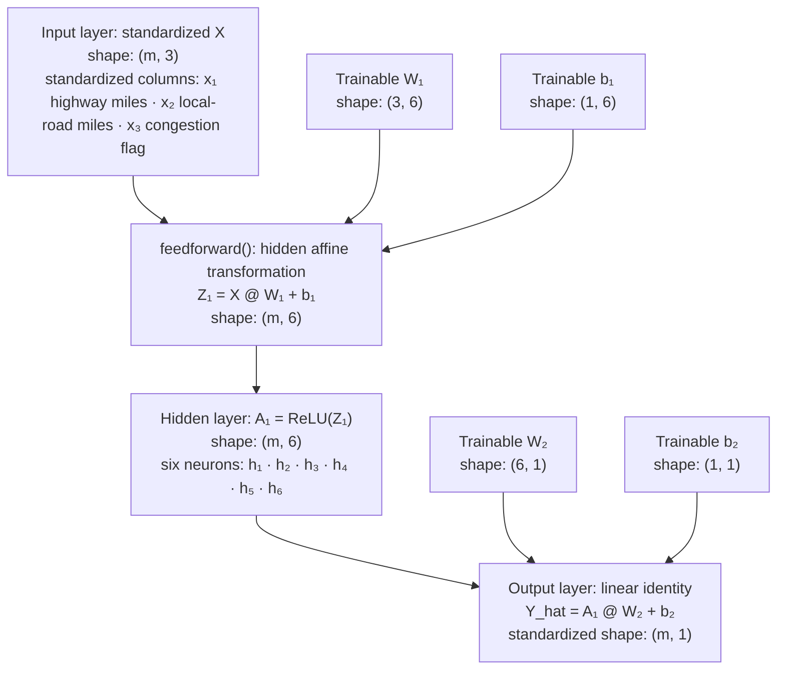
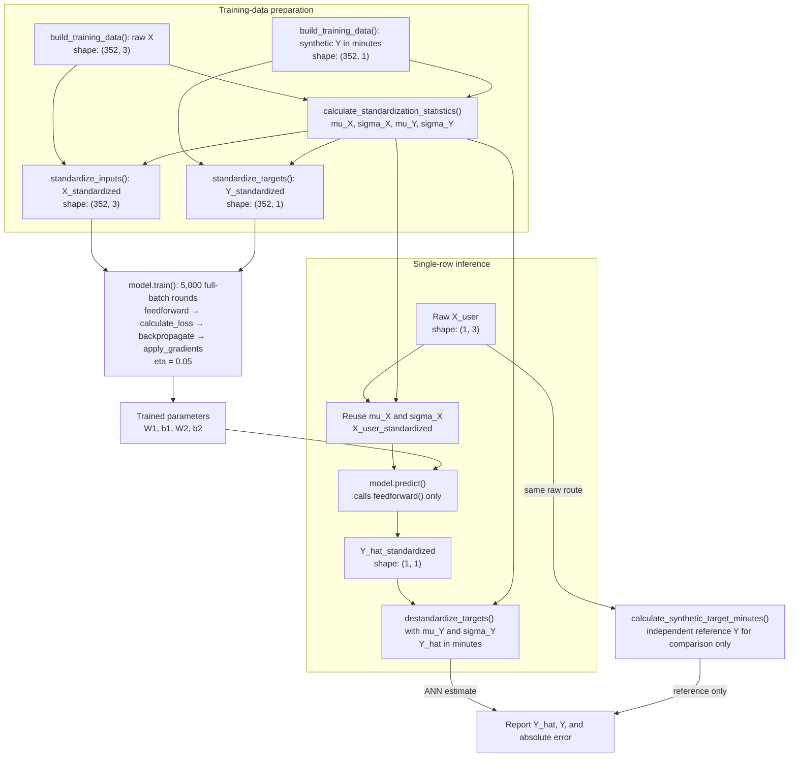
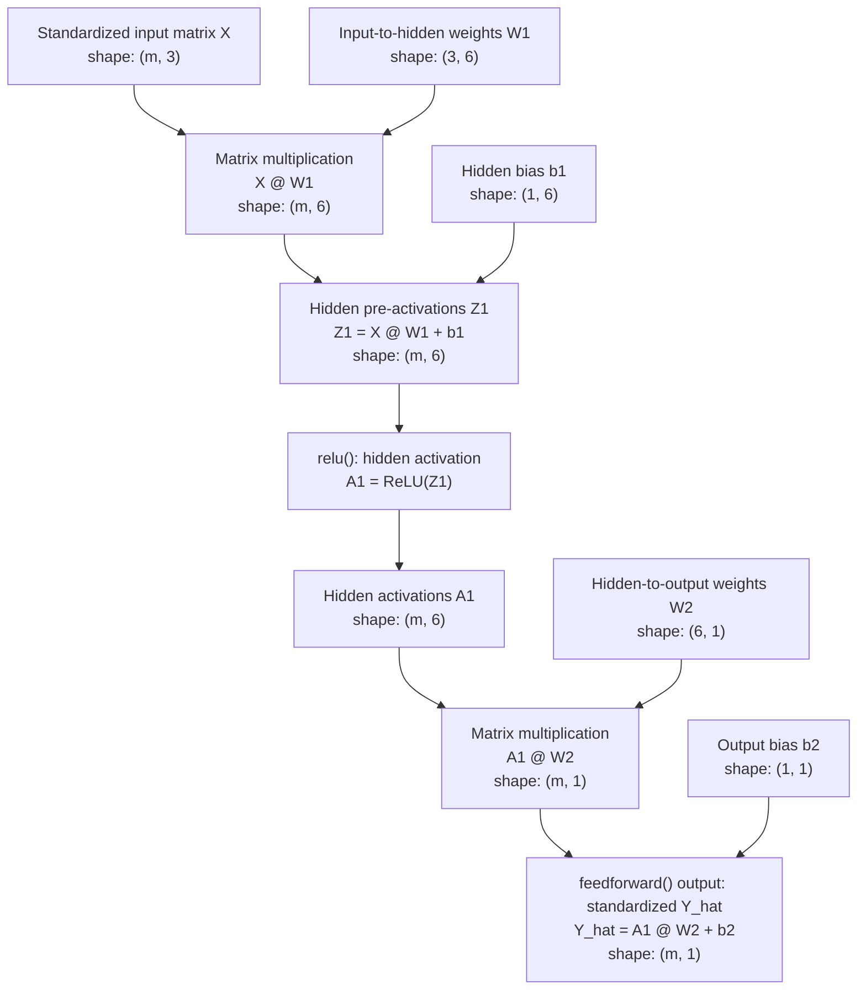
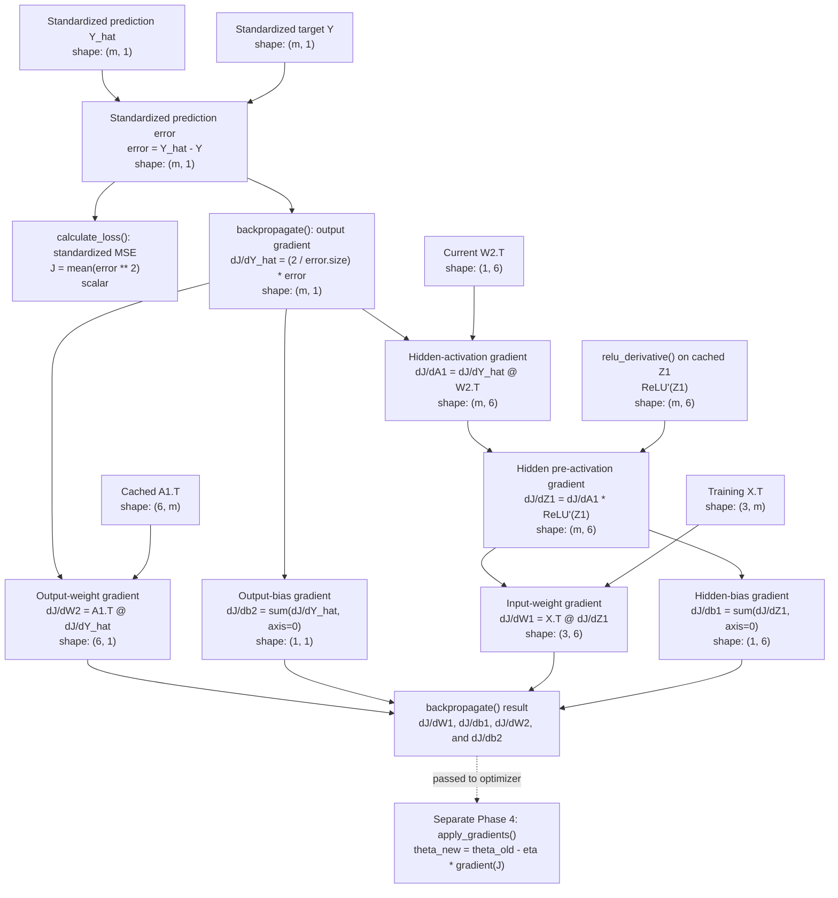

# Critical Thinking Module 3

**Program:** Shallow Neural Network (2-layer) predicting store delivery duration in minutes to a customer's place

**Date:** 08/02/2026  
**Grade:**

---

**Course:** CSC510 - Foundations of Artificial Intelligence  
**Professor:** Dr. Isaac Gang  
**Term:** Fall A (26FA) - 2026  
**Student:** Alexander (Alex) Ricciardi

---

## Assignment:

Hand-Made Shallow ANN in Python
Using your research and resources, write a basic 2-layer Artificial Neural Network utilizing static backpropagation using Numpy in Python. Your neural network can perform a basic function, such as guessing the next number in a series. Using the activation function of your choice to calculate the predicted output ŷ, known as the feedforward function, and updating the weights and biases through gradient descent (backpropagation) based on your choice of a basic loss function.  

Your ANN should include the following features:  

- An input layer that takes input data as a matrix receives and passes it on
- A hidden layer
- An output layer
- Weights between the layers.

Also, your ANN should demonstrate it can perform the following functions:

- Multiply the input by a set of weights (via matrix multiplication)
- Apply deliberate activation function for every hidden layer
- Return an output
- Calculate error by taking the difference from the desired output and the predicted output giving us the gradient descent to provide our loss function
- Apply loss function to weights
- Repeat this process no less than 1,000 times to train the ANN

Your submission should be a script with the .py extension. It should be able to be activated easily and have the ability to accept simple inputs, such as a series of a particular number of variables or digits, in a manner that is clear to the user and predict and visually the final variable in the input set. The input and output are up to you. Keep it simple. 

---

## Program Requirements

[](https://www.python.org/downloads/)
[](https://numpy.org/)

---

## Program Overview

`handmade_shallow_ann.py` is a small standalone Python script that implements a hand-made shallow artificial neural network using only NumPy.  
The program predicts a store delivery duration in minutes to a customer's place based on three user inputs:

- Highway miles
- Local-road miles
- A congestion flag, where `0` means normal traffic and `1` means congested traffic

The model uses a `3 -> 6 -> 1` neural network architecture:

- Three input values
- One hidden layer containing six ReLU neurons
- One linear output that predicts a continuous standardized target
- Two trainable weight matrices and two trainable bias arrays

The raw inputs and targets are standardized before the ANN receives them. 

### Synthetic Training Data

The script constructs a deterministic supervised-learning dataset from every combination in this
grid:

| Feature | Values used for training | Count |
| --- | --- | ---: |
| `x1`, highway miles | `0` through `30` in increments of `2` | 16 |
| `x2`, local-road miles | `0` through `10` in increments of `1` | 11 |
| `x3`, congestion flag | `0` for normal or `1` for congested | 2 |

This produces `16 * 11 * 2 = 352` paired examples: raw `X` has shape `(352, 3)` and
raw `Y` has shape `(352, 1)`. Each synthetic target is calculated independently of the ANN:

```text
highway_speed = 50 mph when x3 = 0; 25 mph when x3 = 1
Y_minutes = 10 + (x1 / highway_speed) * 60 + (x2 / 20) * 60
```

The `10` is the fictional preparation time, and `20 mph` is the assumed local-road speed. These
targets are classroom data, not real delivery-time estimates. The generated pairs are all used for
full-batch training; the script does not create a separate validation or test split.

### ANN Architecture



The diagram shows only the ANN itself. Standardization occurs before its input layer, and conversion
back to minutes occurs after its output layer. In the matrix shapes, `m` is the number of examples
processed together in the current batch:

- `INPUT_SIZE = 3`: standardized input matrix `X` has shape `(m, 3)`.
- `HIDDEN_SIZE = 6`: hidden activation matrix `A1` has shape `(m, 6)`.
- `OUTPUT_SIZE = 1`: standardized prediction matrix `Y_hat` has shape `(m, 1)`.

For training, `m = 352`; for the single user prediction, `m = 1`. The hidden layer uses ReLU, and
the output layer uses the linear identity function. `W1` is initialized with He scaling, `W2` with
Xavier-style scaling, both biases with zeroes, and the random generator with seed `510` so the run is
repeatable.

The program trains for `5,000` full-batch rounds, exceeding the assignment minimum of `1,000`.
It uses learning rate `eta = 0.05`, displays the standardized MSE loss before and during training,
explains what each loss value means, and shows one example weight before and after optimization.

### End-to-End Data and Prediction Pipeline <br><br>



---

## How the ANN Learns

Each training round keeps the four learning phases separate and visible:

1. **Feedforward propagation:** Calculates hidden activations and a prediction.
2. **Loss evaluation:** Names the prediction error as `Y_hat - Y` and calculates scalar loss `J`.
3. **Backpropagation:** Uses the chain rule to calculate `dJ/dW1`, `dJ/db1`, `dJ/dW2`,
   and `dJ/db2`.
4. **Gradient descent:** Applies those derivatives in a separate update method using learning
   rate `eta`.

### Forward Propagation Diagram <br><br>

Forward propagation moves from the input matrix toward the prediction. It uses the current
weights and biases but does not change them.



During training, both `X` and the comparison target `Y` are standardized and `m = 352`. During
inference, the same feedforward equations receive one standardized user row and `m = 1`.
Feedforward does not convert its result to minutes; `destandardize_targets()` performs that separate
step after `predict()` returns.

### Backpropagation Diagram <br><br>

Backpropagation begins after the prediction has been compared with the target. It moves backward
through the network and calculates the gradients for all four trainable parameter arrays.



The loss and output derivative both use the same cached `error = Y_hat - Y` matrix. This mirrors the
implementation: `calculate_loss()` evaluates `J`, while `backpropagate()` separately receives the
error and calculates gradients. The resulting gradient dictionary is then passed to
`apply_gradients()`; backpropagation itself does not update parameters.

The central data, training, and inference equations implemented by the script are:

```text
Y_minutes = 10 + (x1 / highway_speed) * 60 + (x2 / 20) * 60
X_standardized = (X - mu_X) / sigma_X
Y_standardized = (Y - mu_Y) / sigma_Y
Z1 = X @ W1 + b1
A1 = ReLU(Z1)
Y_hat = A1 @ W2 + b2
error = Y_hat - Y
J = mean(error ** 2)
theta_new = theta_old - eta * gradient(J)
Y_hat_minutes = Y_hat_standardized * sigma_Y + mu_Y
```

### Equation-to-Code Naming Convention

Equation-related variables begin with the mathematical symbol they represent and then add a
plain-language description. This makes each line of NumPy code traceable to the equation above it:

- `X` becomes `x_input_matrix` or another `x_...` variable.
- `Z1` becomes `z1_hidden_pre_activations`.
- `A1` becomes `a1_hidden_activations`.
- `Y_hat` becomes `y_hat_predictions`.
- `Y` becomes `y_target_matrix`.
- `Y_hat - Y` becomes `y_hat_minus_y_error`.
- `J` becomes `j_mse_loss` or another `j_...` variable.
- `eta` becomes `eta_learning_rate`.
- `mu` and `sigma` become `mu_..._mean` and `sigma_..._std`.
- A derivative such as `dJ/dW1` becomes `d_j_d_w1_weight_gradient`.

For example, the feedforward equations now appear directly in the variable names:

```python
# Step 1: X @ W1 + b1 -> Z1
z1_hidden_pre_activations = x_input_matrix @ self.W1 + self.b1

# Step 2: ReLU(Z1) -> A1
a1_hidden_activations = self.relu(z1_hidden_pre_activations)

# Step 3: A1 @ W2 + b2 -> Y_hat
y_hat_predictions = a1_hidden_activations @ self.W2 + self.b2
```

Backpropagation follows the same convention. For example,
`d_j_d_y_hat_output_gradient` stores `dJ/dY_hat`, while
`d_j_d_w1_weight_gradient` stores `dJ/dW1`. Gradient dictionary keys also mirror the equations:
`dJ_dW1`, `dJ_db1`, `dJ_dW2`, and `dJ_db2`.

Every equation-related function or method now includes two explicit docstring sections:

- **Related Equation** or **Related Equations:** Lists the mathematics implemented or used.
- **Equation Relationship:** Explains whether the software unit evaluates a mathematical function,
  coordinates a process, calculates gradients, performs optimization, constructs `X` and `Y`, or
  only displays a previously calculated value.

This distinction matters because feedforward propagation is a process, ReLU and MSE are
mathematical functions, backpropagation is a gradient-calculation algorithm, and gradient descent
is the separate optimization step that updates parameters.

The Python file retains the established project comment format, including the standardized file
header, section banners, class and function wrappers, proportional docstrings, intent labels, and
step comments for the main training loop.

---

## How to Run the Script

Run the following commands from the repository root.

1. Install NumPy into the project virtual environment:

   ```bash
   .venv/bin/python -m pip install -r CTA_Module-3/requirements.txt
   ```

2. Start the ANN script:

   ```bash
   .venv/bin/python CTA_Module-3/handmade_shallow_ann.py
   ```

3. Read each section and press `Enter` when the console asks to continue. After training, enter
   the three requested values. For example:

   ```text
   Enter x1, highway miles (0 to 30): 10
   Enter x2, local-road miles (0 to 10): 2
   Enter x3, traffic condition (0 = normal, 1 = congested): 1
   ```

For this example, the trained ANN should predict approximately `40` minutes. The final `Y_hat` is
highlighted in a green console box. The script then prints the synthetic reference target `Y`, the
absolute difference `|Y_hat - Y|`, and the same error in seconds so the result is easier to interpret.

---

## Files

```text
./
├── handmade_shallow_ann.py
├── requirements.txt
├── console-output.pdf
└── README.md
```

---

My Links:

<p align="left">
<a href="https://github.com/AngryOwlAI/"></a>
<a href="https://www.alexomegapy.com"></a><a href="https://www.alexomegapy.com"></a>
<a href="https://medium.com/@alex.omegapy"></a>
<a href="https://x.com/AlexOmegapy"></a>
<a href="https://www.youtube.com/@AngryOwl-AI"></a>
<a href="https://www.facebook.com/profile.php?id=100089638857137"></a>
<a href="https://linkedin.com/in/alex-ricciardi"></a>
<a href="https://www.threads.net/@alexomegapy?hl=en"></a>
<a href="https://dev.to/alex_ricciardi"></a>
</p>
