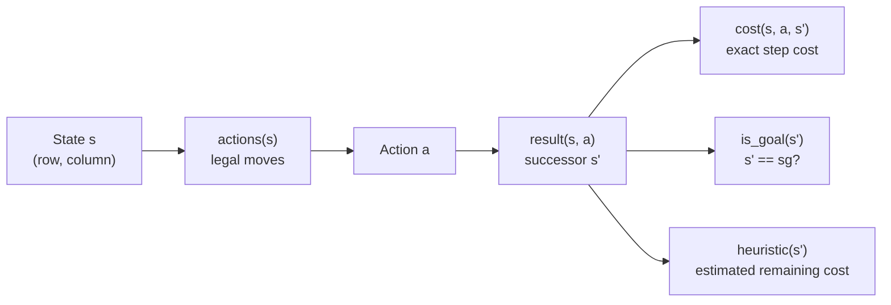
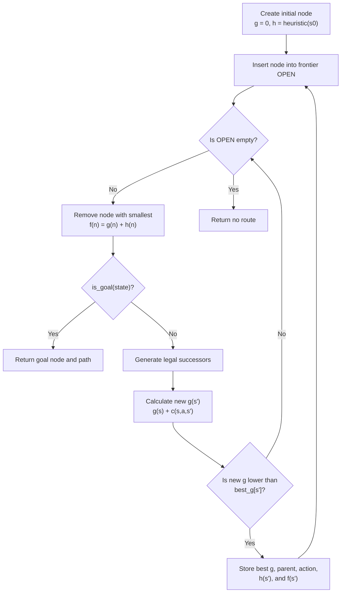
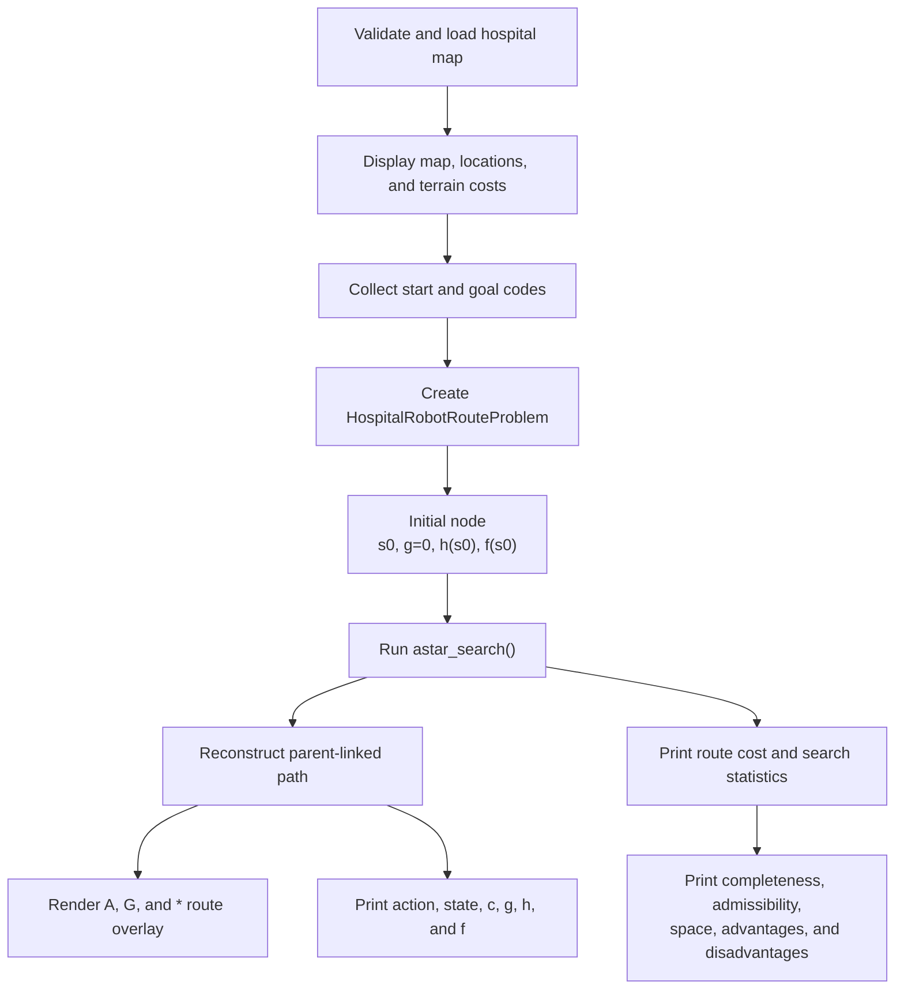

# Critical Thinking Module 4

Program: Hospital Medication-Delivery Robot Route Planner Using A* Graph Search

Date: 08/16/2026   
Grade:

---

Foundations of Artificial Intelligence CSC510   
Professor: Dr. Isaac Gang  
Fall A (26FA) – 2026   
Student: Alexander (Alex) Ricciardi 

---

## This Assignment Directions

Heuristic search functions used in Informed Search methods represent a compelling AI development strategy capable of performing many possible functions and solving a wide variety of problems.

Review the following resources:

- <https://pypi.org/project/simpleai/>
- <https://github.com/simpleai-team/simpleai>

Examine the examples given under the "samples" directory in the simpleai Github page (available in the resource above).

Define a simple real-world search problem requiring a heuristic solution. You can base the problem on the 8-puzzle (or n-puzzle) problem, Towers of Hanoi, or even Traveling Salesman. The problem and solution can be utilitarian or entirely inventive.

Write an interactive Python script (using either simpleAI's library or your resources) that utilizes either Best-First search, Greedy Best First search, Beam search, or A* search methods to calculate an appropriate output based on the proposed function. The search function does not have to be optimal nor efficient but must define an initial state, a goal state, reliably produce results by finding the sequence of actions leading to the goal state. Submission should be in an easily executable Python file alongside instructions for testing. Please include in your submission the type of search algorithm used along with at least a paragraph justifying your choice. In your justification, consider the following questions as a guide:

- Is your search method complete? Is it admissible?
- Does it use an evaluation function?
- Is it space-efficient? 
- What are the advantages and disadvantages of your chosen search method, and how do they fit the intended function?

Reference  
PyPI. (2021, September 2). SimpleAI (Version 0.8.3)

---

## Program Requirements

[](https://www.python.org/downloads/)
[](#program-requirements)
[](#a-search-method)

The program uses only the Python 3.11+ standard library. No third-party package is required.

The Program follows the SimpleAI structure; it did not import the SimpleAI package. This allowsthe the functionality of to be inspected. The "problem class" implements the following required methods:

```text
actions(state)
result(state, action)
is_goal(state)
cost(state, action, state2)
heuristic(state)
```

---

## The Program 

`hospital_robot_astar.py` is a script that plans a route for a hospital medication delivery robot. The user selects a hospital location as the initial state and another as the goal state. A* search is used to find the optimal path.

The A* search must account for the cost of moving through different types of cells. Normal corridors cost `1` unit to enter, busy corridors cost `3`, and sanitation work zones cost `6`. Walls are blocked. The route planner can therefore prefer a longer clear route over a shorter but more expensive route.

Search Example:

```text
Initial state: P - Pharmacy at (row 1, column 1)
Goal state:    E - Emergency Department at (row 11, column 29)
```

The verified result is:

```text
Movement actions: 38
Total route cost: 44 cost units
Goal reached: True
```

The route contains 34 normal corridor entries, 3 busy corridor entries, and the final goal location. It avoids all sanitation work-zone cells.

---

## Real-World Search Problem

### Fictional Scenario

A hospital decided to automate the delivery of medication and supplies using a small autonomous robot. A normal corridor is easy to traverse. A busy corridor requires the robot to slow down. A sanitation work zone is traversable, but it has a higher traversal cost and should be avoided when possible.

The function of the program is to calculate a low-cost movement plan from a selected hospital location to another selected location.

### Locations

| Code | Hospital Location          | Coordinate |
| ---- | -------------------------- | ---------- |
| P    | Pharmacy                   | (1, 1)     |
| N    | Nurses' Station            | (1, 31)    |
| L    | Laboratory                 | (11, 1)    |
| E    | Emergency Department       | (11, 29)   |
| S    | Medical Supply Room        | (13, 1)    |
| C    | Robot Charging Station     | (13, 31)   |

### Initial State

The initial state is the coordinate of the selected starting location:

```text
s0 = (start_row, start_column)
```

The default demonstration uses:

```text
s0 = (1, 1) = Pharmacy
```

### Goal State

The goal state is the coordinate of the selected destination:

```text
sg = (goal_row, goal_column)
```

The default demonstration uses:

```text
sg = (11, 29) = Emergency Department
```

### State Representation

Every state is an immutable tuple:

```python
state = (row, column)
```

Tuple states are hashable. The graph-search implementation can therefore use them as dictionary keys when it stores the best discovered route cost for each coordinate.

### Actions

The robot can perform these actions:

```text
MOVE UP
MOVE RIGHT
MOVE DOWN
MOVE LEFT
```

An action is legal only when its successor coordinate is inside the map and is not a wall.

### Result Function

Each action applies a row-column offset:

```text
MOVE UP:    s' = (row - 1, column)
MOVE RIGHT: s' = (row, column + 1)
MOVE DOWN:  s' = (row + 1, column)
MOVE LEFT:  s' = (row, column - 1)
```

### Goal Test

```text
is_goal(s) = True when s == sg
```

### Constraints

- The map is finite and rectangular.
- The outer border is a wall.
- The robot cannot enter `#` cells.
- The robot moves one orthogonal cell per action.
- Diagonal movement is not permitted.
- Every legal movement has a positive finite cost.
- Interactive execution requires different start and goal locations.

---

## Hospital Floor Map

```text
    Column numbers
    0         10        20        30
 0  #################################
 1  #P..............#..............N#
 2  #.###########...#...###########.#
 3  #...............#...............#
 4  #.#####.#################.#####.#
 5  #.....#.......~~~.......#.......#
 6  #####.#.#####.~~~.#####.#.#######
 7  #.....#.....#..~~~#.....#.......#
 8  #.#########.#..!!!#.###########.#
 9  #...........#.....#.............#
10  #.###########.!!!.###########...#
11  #L............!!!............E..#
12  #.###############.#############.#
13  #S.............................C#
14  #################################
```

### Traversal-Cost Model

| Symbol     | Meaning          | Cost to enter |
| ---------- | ---------------- | ------------: |
| #          | Wall             | Blocked       |
| .          | Normal corridor  | 1             |
| ~          | Busy corridor    | 3             |
| !          | Sanitation zone  | 6             |
| P,N,L,E,S,C | Named location  | 1             |

The cost belongs to the destination cell. For example, moving from a normal corridor into a busy corridor costs `3` units.

---

## SimpleAI-Style Problem Structure



The concrete `HospitalRobotRouteProblem` class owns all domain-specific logic. The `astar_search()` function does not need to know what a hospital, corridor, wall, or robot is. It asks the problem object for valid actions, successor states, action costs, the goal test, and the heuristic.

---

## A* Search Method

A* is a best-first informed search algorithm. It ranks each frontier node with an evaluation function:

```text
f(n) = g(n) + h(n)
```

Where:

- `n` is one search node.
- `g(n)` is the exact accumulated route cost from the initial state to `n`.
- `h(n)` is the estimated remaining route cost from `n` to the goal.
- `f(n)` is the estimated total cost of a complete route through `n`.

The program uses a priority queue. The node with the smallest `f(n)` is selected first. If two nodes have the same `f(n)`, the smaller `h(n)` is preferred, followed by deterministic insertion order.

### A* Search Cycle



### Repeated-State Control

The dictionary `best_g_path_cost_by_state` stores the lowest discovered route cost for each coordinate:

```text
best_g[state] = lowest discovered g(n)
```

A successor is added to the frontier only when its new `g(n)` is lower than the stored value. This is the graph-search behavior that prevents loops and removes inferior repeated routes.

---

## Heuristic Function

The program uses Manhattan distance multiplied by the minimum legal move cost:

```text
h(n) = (|row - goal_row| + |column - goal_column|) * c_min
```

For this map:

```text
c_min = 1
```

Therefore:

```text
h(n) = |row - goal_row| + |column - goal_column|
```

### Symbol Definitions

- `row` is the current state's row.
- `column` is the current state's column.
- `goal_row` is the goal state's row.
- `goal_column` is the goal state's column.
- `c_min` is the minimum possible cost of one legal movement.
- `h(n)` is the estimated remaining cost.

### Why Manhattan Distance Fits

The robot moves only up, right, down, or left. One legal action can change the Manhattan distance by at most one. Manhattan distance therefore measures the fewest possible movement actions when walls and terrain penalties are temporarily ignored.

The heuristic gives A* direction toward the goal without claiming that the direct route is actually available.

### Admissibility

Strictly, admissibility describes the heuristic, not the Python function as a whole.

The heuristic is admissible because it never overestimates the true remaining route cost. It assumes that every remaining movement can cost the minimum value of `1` and that no wall will force a detour. The real route can equal this optimistic estimate, but walls and higher-cost terrain can only make the real cost greater.

```text
0 <= h(n) <= h*(n)
```

Where `h*(n)` is the actual minimum remaining cost.

### Consistency

The heuristic is also consistent when every legal edge satisfies:

```text
h(s) <= c(s, a, s') + h(s')
```

The program's internal verification and unit test check this inequality on every legal map edge. They also confirm:

```text
h(goal) = 0
```

---

## Completeness, Optimality, and Space Use

### Is the Search Complete?

Yes. The map contains a finite number of reachable states. Every action cost is positive. Graph-search repeated-state control prevents the algorithm from cycling forever through the same coordinates. Finally, A* reaches the goal or exhausts all reachable states.

### Is It Admissible?

The program uses the Manhattan heuristic, which is admissible. In this program, the heuristic is admissible and consistent.

### Does It Use an Evaluation Function?

Yes:

```text
f(n) = g(n) + h(n)
```

The implementation stores all three values in each `SearchNode`.
The output table displays the step cost, `g(n)`, `h(n)`, and `f(n)` for every state.

### Is It Space Efficient?

A* is not ussually space efficient, meaning that it can use a lot of memory. The A* implementation stores frontier nodes and best path costs for discovered states. In large search spaces, this implementation's memory usage can grow exponentially. However, for this assignment, the search space is the finite set of cells (the space does not increase) and the map is small. Therefore, the memory usage is acceptable.

---

## Advantages and Disadvantages

### Advantages

- A* considers both the cost already paid and the estimated cost to the goal.
- The route can avoid expensive terrain rather than merely minimizing the number of steps.
- The admissible and consistent heuristic supports a minimum-cost result.
- Immutable coordinate states make repeated-state control direct and reliable.
- The returned parent links provide an exact action sequence from start to goal.
- The evaluation values make the search decision explainable.

### Disadvantages

- A* can require substantial memory on larger maps.
- Search performance depends on heuristic quality.
- Manhattan distance does not know about walls or terrain penalties, so it can be weak in maze-like areas.
- The fixed map is a classroom model, not a live hospital navigation system.
- A real robot would also require localization, dynamic obstacle detection, safety controls, and path replanning.

### Why A* Was Selected Instead of the Other Allowed Methods

Greedy Best-First Search uses only `h(n)`. It may reach the goal quickly, but it can ignore the cost already accumulated and choose an expensive corridor.

Uniform-Cost Search uses only `g(n)`. It is suitable for weighted paths, but it ignores goal direction and may expand more states than necessary.

Beam Search limits the frontier width, which can reduce memory use, but it can discard the only route leading to the goal.

A* provides the best fit for this function because it balances exact route cost and goal-directed estimation.

---

## End-to-End Program Flow



---

## Code Organization and Naming Convention

The script follows the established assignment structure used in the previous module:

- Standardized file header and course metadata.
- Section banners.
- Class and function wrappers.
- Proportional docstrings.
- Equation-to-code names.
- Explicit assignment-requirement comments.
- Human-readable console sections and optional color.
- Enter-key pauses only during an interactive terminal run.

Equation-related variables begin with the mathematical value they represent:

| Mathematical value        | Code name                              |
| --------------------------| -------------------------------------- |
| State `s`                 | `s_current_state`, `s_successor_state` |
| Initial state `s0`        | `s_initial_state`                      |
| Goal state `sg`           | `s_goal_state`                         |
| Exact path cost `g(n)`    | `g_path_cost`, `g_current_path_cost`   |
| Heuristic `h(n)`          | `h_estimated_remaining_cost`           |
| Evaluation `f(n)`         | `f_evaluation_cost`                    |
| Action cost `c(s,a,s')`   | `step_cost`                            |
| Frontier `OPEN`           | `frontier_heap`                        |
| Best known path cost      | `best_g_path_cost_by_state`            |

---

## Interactive Features

The default run is interactive. It:

1. Displays the problem definition.
2. Displays the map and terrain costs.
3. Displays the named-location menu.
4. Accepts a one-letter location code or menu number.
5. Rejects invalid entries and requests another entry.
6. Rejects a goal that is identical to the start.
7. Displays the A* evaluation function and heuristic.
8. Finds the route.
9. Displays a route map.
10. Displays a compact direction sequence.
11. Displays every action and state.
12. Displays total cost and observed search statistics.
13. Displays the required algorithm justification.

The script automatically suppresses pauses when standard input is redirected or when `--no-pause` is supplied.

---

## How to Run the Script

Run the following commands from the assignment folder.

### 1. Confirm Python

```bash
python --version
```

Use Python 3.11 or newer.

### 2. Optional Requirements Command

The project has no third-party dependencies, but the supplied file can still be checked:

```bash
python -m pip install -r requirements.txt
```

### 3. Start the Interactive Program

```bash
python hospital_robot_astar.py
```

The program displays the location menu and prompts for a starting location and goal location. Press `Enter` to accept the defaults:

```text
Start: P - Pharmacy
Goal:  E - Emergency Department
```

A location can be selected by code or number. For example:

```text
Select starting location [P]: L
Select goal location [E]: N
```

### 4. Run the Reproducible Default Demonstration

```bash
python hospital_robot_astar.py --demo --no-color --no-pause
```

### 5. Run a Specific Route Without Prompts

```bash
python hospital_robot_astar.py --start S --goal N --no-color --no-pause
```

### 6. Run Internal Verification

```bash
python hospital_robot_astar.py --verify-map --no-color --no-pause
```

```bash
python hospital_robot_astar.py --start C --goal P --no-color --no-pause
```

### Invalid-Input Check

Run interactively and enter an invalid code such as `Z`. The script must display an error and request another location.

A reproducible redirected-input check is:

```bash
printf 'Z\nP\nP\nE\n' | python hospital_robot_astar.py --no-color --no-pause
```

The expected behavior is:

1. Reject `Z` as an unknown location.
2. Accept `P` as the start.
3. Reject `P` as the goal because it matches the start.
4. Accept `E` as the goal.
5. Find the route.

---

## Verified Default Route

## Verified Default Route

The reproducible default demonstration produces these primary results:

```text
Initial state:                        P - (row 1, column 1) - Pharmacy
Goal state:                           E - (row 11, column 29) - Emergency Department
Goal reached:                         True
Movement actions:                     38
Total route cost g(goal):             38.0 cost units
Expanded nodes:                       63
Generated nodes:                      82
Unique states discovered:             79
Maximum frontier size:                19
```

The route overlay is:

```text
    Column numbers
    0         10        20        30
 0  #################################
 1  #A..............#..............N#
 2  #*###########...#...###########.#
 3  #*******........#...............#
 4  #.#####*#################.#####.#
 5  #.....#*******~~~.......#.......#
 6  #####.#.#####*~~~.#####.#.#######
 7  #.....#.....#**~~~#.....#.......#
 8  #.#########.#.*!!!#.###########.#
 9  #...........#.****#.............#
10  #.###########.!!!*###########...#
11  #L............!!!************G..#
12  #.###############.#############.#
13  #S.............................C#
14  #################################
```

`A` is the initial state, `G` is the goal state, and `*` is the route.

---

## Verification Examples

```bash
python -m py_compile hospital_robot_astar.py
python hospital_robot_astar.py --demo --no-color --no-pause
python hospital_robot_astar.py --verify-map --no-color --no-pause
```

---

## Files

```text
./
├── hospital_robot_astar.py
├── README.md
├── testing_program.md
├── Critical-Thinking-Module-4.docx
└── console-output.pdf
```

- `hospital_robot_astar.py` is the script.
- `README.md` Project documentation.
- `testing_program.md` Testing instructions.
- `Critical-Thinking-Module-4.docx` Justification of the search method paragraph.
- `console-output.pdf` The program execution results.

---

My Links:

<p align="left">
<a href="https://github.com/AngryOwlAI/"></a>
<a href="https://www.alexomegapy.com"></a><a href="https://www.alexomegapy.com"></a>
<a href="https://medium.com/@alex.omegapy"></a>
<a href="https://x.com/AlexOmegapy"></a>
<a href="https://www.youtube.com/@AngryOwl-AI"></a>
<a href="https://www.facebook.com/profile.php?id=100089638857137"></a>
<a href="https://linkedin.com/in/alex-ricciardi"></a>
<a href="https://www.threads.net/@alexomegapy?hl=en"></a>
<a href="https://dev.to/alex_ricciardi"></a>
</p>
