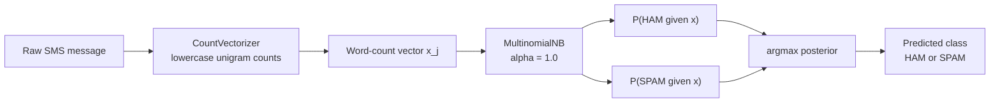
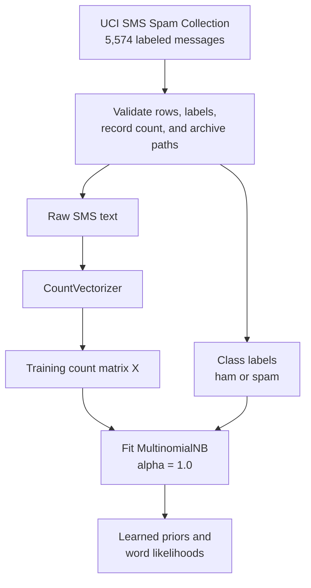
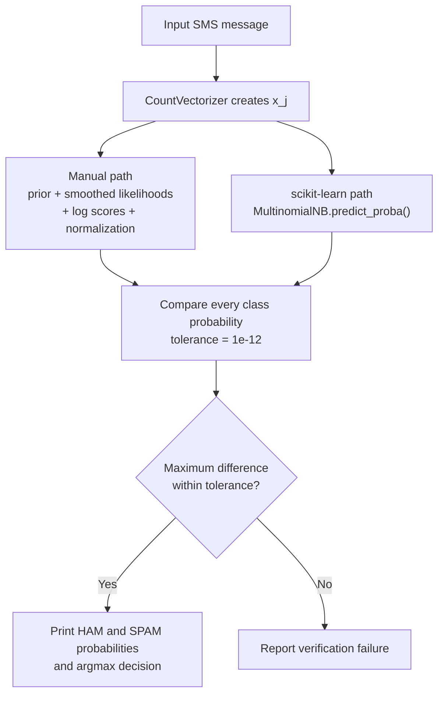
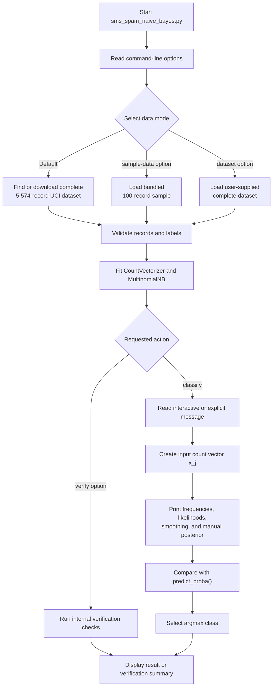

# Critical Thinking Module 6

Program: UCI SMS Spam Multinomial Naive Bayes Classifier

Date: 08/30/2026   
Grade: 100% | A

---

Foundations of Artificial Intelligence CSC510   
Professor: Dr. Isaac Gang  
Fall A (26FA) – 2026   
Student: Alexander (Alex) Ricciardi 

---

## Assignment Directions

**Naive Bayes Classifier**

Naive Bayes classifiers are quick and easy to code in Python and are very efficient. 

Naive Bayes classifiers are based on Bayes' Theorem and assume independence among predictors (hence the "Naive" terminology). Not only are Naive Bayes classifiers handy and straightforward in a pinch, but they also outperform many other methods without the need for advanced feature engineering of the data.

Read the following article for further information on Naive Bayes classification: 

https://www.ibm.com/think/topics/naive-bayes

Using scikit-learn, write a Naive Bayes classifier in Python. It can be single or multiple features. Submit the classifier in the form of an executable Python script alongside basic instructions for testing.

Your Naive Bayes classification script should allow you to do the following:

Calculate the posterior probability by converting the dataset into a frequency table.
Create a "Likelihood" table by finding relevant probabilities.
Calculate the posterior probability for each class.
Correct Zero Probability errors using Laplacian correction.
Your classifier may use a Gaussian, Multinomial, or Bernoulli model, depending on your chosen function. Your classifier must properly display its probability prediction based on its input data.

Check out scikit-learn and its documentation at the following website:
https://scikit-learn.org/stable/


---

## Assignment requirement 

| Assignment requirement | Program implementation |
| --- | --- |
| Classification | Predicts `HAM` or `SPAM`. |
| Frequency table | Calculates message counts by class and word counts by class. |
| Likelihood table | Calculates `P(w_j | C_k)` for the words used by the input message. |
| Posterior for each class | Calculates and displays `P(HAM | x)` and `P(SPAM | x)`. |
| Zero-probability correction | Uses Laplace smoothing with `alpha=1.0`. |
| scikit-learn model | Uses `sklearn.naive_bayes.MultinomialNB`. |
| Probability display | Prints manual and `predict_proba()` values side by side. |
| Basic testing | Provides a verification mode and 23 automated tests. |

---

## Program Requirements

[](https://www.python.org/downloads/)
[](https://numpy.org/)
[](https://scikit-learn.org/stable/)
[](#why-multinomial-naive-bayes-was-selected)
[](#uci-sms-spam-collection)


### Model configuration

```python
MultinomialNB(
    alpha=1.0,
    fit_prior=True,
    force_alpha=True,
)
```

| Parameter | Purpose |
| --- | --- |
| `alpha=1.0` | Applies Laplace add-one smoothing. |
| `fit_prior=True` | Learns `P(C_k)` from the class-frequency table. |
| `force_alpha=True` | Keeps the supplied smoothing value unchanged. |

`CountVectorizer` creates lowercase unigram counts. It keeps repeated words by
using `binary=False`, so the input features are discrete, nonnegative integers.

---

## The Program 

The programm is a Multinomial Naive Bayes classifier for UCI SMS messages program.

The program classifies an inputted SMS message as HAM or SPAM. 
It uses CountVectorizer that learns a vocabulary from the UCI SMS dataset 
and converts each SMS message into vectorized word counts. 
Note that the dataset has 5,574 SMS messages, 4,825 HAM (non-spam) and 
747 SPAM.

Then a Multinomial Naive Bayes model, MultinomialNB(alpha=1.0), is trained 
using the vectorized word counts to categorize the SMS messages as HAM or SPAM.
This training allows the model to learn the class priors HAM and SPAM. The 
Laplace-smoothed method is used to calculate the word likelihoods, 
preventing a word with a zero count in one class from making that class's 
probability zero. 

A new message entered by a user or by the demo feature of the program is converted 
into vectorized word counts based on the vocabulary learned from the training dataset. 
Then, the program calculates the posterior probabilities that the new message is 
HAM or SPAM step by step using both its own functions and scikit-learn's 
predict_proba() method. The two probability results are compared to verify that they match.
Then, the class with the highest posterior probability is returned as the final prediction.

Finally, it displays the results with an explanation of the probability calculation.

---

## Files and module responsibilities

```text
./
├── sms_spam_naive_bayes.py
├── sms_config.py
├── sms_types.py
├── sms_cli.py
├── sms_dataset.py
├── sms_training.py
├── sms_probability.py
├── sms_terminal.py
├── sms_display.py
├── sms_verification.py
├── test_sms_spam_naive_bayes.py
├── README.md
├── terminal-output.pdf
└── data/
    ├── SMSSpamCollection
    └── SMSSpamCollection.sample
```

### Python modules

| File | What the module does |
| --- | --- |
| `sms_spam_naive_bayes.py` | Provides the executable entry point and high-level coordinator. `main()` selects the requested action, calls the other modules in order, and returns the process status. `run_teaching_classification()` calculates one prediction and sends the stored result through the five teaching sections. The file also exposes imported component names so existing code can continue importing them from the main module. |
| `sms_config.py` | Stores shared constants and configuration. These values include program metadata, display limits, dataset paths, expected record counts, deterministic messages, `CountVectorizer` settings, `MultinomialNB` settings, the numerical tolerance, and ANSI color codes. |
| `sms_types.py` | Defines the shared error hierarchy and the dataclasses passed between modules. `SmsDataset` stores validated records, `TrainedSmsModel` stores fitted model state, `PosteriorCalculation` stores every prediction step, and `VerificationCheck` stores one check result. |
| `sms_cli.py` | Defines command-line options, resolves the selected dataset source, and collects the message to classify. It recognizes explicit messages, demo mode, interactive input, verification mode, and incompatible option combinations. It does not train the model or calculate probabilities. |
| `sms_dataset.py` | Reads and validates UCI-format SMS data. It decodes the file, parses labels and messages, checks record counts, validates ZIP members, extracts the official dataset safely, and downloads the UCI archive when requested. |
| `sms_training.py` | Converts validated SMS messages into word-count features with `CountVectorizer`, validates the count matrix, fits one `MultinomialNB` model, and packages the fitted estimator and lookup data in `TrainedSmsModel`. |
| `sms_probability.py` | Reconstructs the Naive Bayes mathematics from the fitted model. It calculates manual class priors, word counts, Laplace-smoothed likelihoods, log-space class scores, normalized posteriors, and the final class index. It also compares the manual posterior with `predict_proba()` and finds a real zero-frequency example. |
| `sms_terminal.py` | Provides reusable terminal-formatting helpers. It detects color support, applies ANSI styles, wraps paragraphs, prints headings and equations, creates fixed-width tables, and manages optional pauses. It does not load data or calculate model results. |
| `sms_display.py` | Builds the learner-facing terminal explanation. It prints the program banner, model equations, dataset frequencies, input counts, likelihoods, Laplace example, manual posterior steps, scikit-learn comparison, final color-coded prediction, and verification report. |
| `sms_verification.py` | Builds structured mathematical and behavioral checks. It compares manual values with fitted scikit-learn values, checks model parameters and dataset contracts, confirms Laplace smoothing, tests representative HAM and SPAM messages, and verifies unknown-vocabulary rejection. It returns check records for the display module. |


### Dataset files

| File | Purpose |
| --- | --- |
| `data/SMSSpamCollection` | Contains the complete 5,574-message UCI SMS Spam Collection used by the default mode. |
| `data/SMSSpamCollection.sample` | Contains the explicit 100-message offline sample used only with `--sample-data`. |
| `data/UCI_DATASET_NOTICE.md` | Records the dataset source, DOI, license, complete-data requirements, and the distinction between complete and sample modes. |

If `data/SMSSpamCollection` is absent, default complete-data mode downloads the
official UCI archive, validates all 5,574 records, and installs the file before
training.

---

## How to install the program

Use the repository-level `.venv` and run these commands from the project root,
`CSC510-CTAs/`.

### 1. Confirm Python

```bash
python3 --version
```

Use Python 3.11 or newer. On Windows, use `py --version`.

If `.venv` does not exist yet, create it from the project root:

```bash
python3 -m venv .venv
```

### 2. Install the Module 6 dependencies

#### macOS or Linux

```bash
.venv/bin/python -m pip install --upgrade pip
.venv/bin/python -m pip install -r CTA_Module-6/requirements.txt
```

Optional activation from the project root:

```bash
source .venv/bin/activate
```

If the terminal is already in `CTA_Module-6/`, activate the same environment
with:

```bash
source ../.venv/bin/activate
```

#### Windows PowerShell

```powershell
py -m venv .venv
.\.venv\Scripts\python.exe -m pip install --upgrade pip
.\.venv\Scripts\python.exe -m pip install -r CTA_Module-6\requirements.txt
```

---

## How to run the Program

### Complete UCI dataset

This is the assignment mode:  
The script validates and uses the complete
local file. If the file is absent, it downloads and validates the official UCI
archive before training:

```bash
.venv/bin/python CTA_Module-6/sms_spam_naive_bayes.py --demo --no-pause
```

Force a fresh download:

```bash
.venv/bin/python CTA_Module-6/sms_spam_naive_bayes.py \
  --download-data \
  --demo \
  --no-pause
```

Use a complete dataset already stored elsewhere:

```bash
.venv/bin/python CTA_Module-6/sms_spam_naive_bayes.py \
  --dataset /path/to/SMSSpamCollection \
  --demo \
  --no-pause
```

### Interactive mode

```bash
.venv/bin/python CTA_Module-6/sms_spam_naive_bayes.py
```

### Explicit message used for testing

```bash
.venv/bin/python CTA_Module-6/sms_spam_naive_bayes.py \
  --message "Dear Valued Customer, Congratulations! Your mobile number has been selected to receive a cash prize worth one thousand dollars. Please call our claims department today and provide your confirmation code to collect your reward before this limited-time offer expires. Sincerely, Rewards Center." \
  --no-pause
```

### Offline sample demonstration

```bash
.venv/bin/python CTA_Module-6/sms_spam_naive_bayes.py \
  --sample-data \
  --demo \
  --no-color \
  --no-pause
```

### Internal verification

Complete dataset:

```bash
.venv/bin/python CTA_Module-6/sms_spam_naive_bayes.py --verify --no-color
```

Offline sample:

```bash
.venv/bin/python CTA_Module-6/sms_spam_naive_bayes.py \
  --sample-data \
  --verify \
  --no-color
```

A successful verification run ends with:

```text
All internal verification checks passed.
```

---

## Basic testing procedure

Run these commands from the project root:

```bash
.venv/bin/python -m compileall -q CTA_Module-6
.venv/bin/python CTA_Module-6/sms_spam_naive_bayes.py --verify --no-color
.venv/bin/python CTA_Module-6/sms_spam_naive_bayes.py \
  --sample-data \
  --verify \
  --no-color
.venv/bin/python CTA_Module-6/sms_spam_naive_bayes.py \
  --sample-data \
  --demo \
  --no-color \
  --no-pause
.venv/bin/python CTA_Module-6/sms_spam_naive_bayes.py \
  --sample-data \
  --message "Are we still meeting for lunch today" \
  --no-color \
  --no-pause
.venv/bin/python CTA_Module-6/sms_spam_naive_bayes.py \
  --sample-data \
  --message "WINNER you have won a free cash prize call now to claim" \
  --no-color \
  --no-pause
```

Expected behavior:

- Python compilation finishes without errors.
- Complete-data verification checks exactly 5,574 records and reports only
  `PASS` results.
- Sample-data verification checks 100 records and reports only `PASS` results.
- The deterministic demonstration predicts `SPAM`.
- The meeting message predicts `HAM`.
- The prize message predicts `SPAM`.
- Manual and scikit-learn probabilities differ by less than `1e-12`.
- Captured output stays within the 92-character terminal width.

### Negative-input test

```bash
.venv/bin/python CTA_Module-6/sms_spam_naive_bayes.py \
  --sample-data \
  --message "qzxqzxqzv nvqzxqzx" \
  --no-color \
  --no-pause
```

The command exits with status `2` and explains that the message contains no terms
from the fitted vocabulary.

---

## Program workflow

The workflow has two separate stages:

1. **Training.** `CountVectorizer` learns the vocabulary and converts the labeled
   training messages into word counts. `MultinomialNB.fit()` then learns the class
   priors `P(C_k)` and the smoothed word likelihoods `P(w_j | C_k)`.
2. **Prediction.** The fitted vectorizer converts one new SMS message into input
   counts `x_j`. The fitted model uses its already learned priors and likelihoods
   to calculate `P(HAM | x)` and `P(SPAM | x)`.

The new message does not train or refit the classifier. It supplies the evidence
used by the trained model to make one prediction.

```text
Given the words in an SMS message:

                  HAM
Message  --------> or
                  SPAM
```

### Classifier structure



The deterministic demonstration message is:

```text
Dear Valued Customer, Congratulations! Your mobile number has been selected to receive a cash prize worth one thousand dollars. Please call our claims department today and provide your confirmation code to collect your reward before this limited-time offer expires. Sincerely, Rewards Center.
```

In the verified 100-record sample run, the program produced:

```text
P(HAM | message)  = 0.000009262867
P(SPAM | message) = 0.999990737133
Predicted class   = SPAM
Winning percentage = 100.00%
```

The complete 5,574-message model can produce different probabilities because it
learns from a much larger corpus.


---

## Classification problem

### Real-world scenario

Unwanted text messages often contain repeated terms related to prizes, urgent
calls, free offers, or claims. Legitimate messages more often contain ordinary
conversation, scheduling, or personal communication. The program learns the
word-frequency patterns associated with each class and uses those patterns to
classify a new message.

### Input

The input is one raw SMS message:

```text
x = "Dear Valued Customer, Congratulations! Your mobile number has been selected to receive a cash prize worth one thousand dollars. Please call our claims department today and provide your confirmation code to collect your reward before this limited-time offer expires. Sincerely, Rewards Center."
```

`CountVectorizer` converts the message into a word-count vector. If the learned
vocabulary contains the words `free`, `prize`, and `call`, their counts become
features used by the classifier.

### Output

The program returns both posterior probabilities and the class with the larger
value:

```text
P(HAM | x)
P(SPAM | x)

predicted class = argmax P(C_k | x)
```

### Classes

| Stored label | Display label | Meaning |
| --- | --- | --- |
| `ham` | `HAM` | Legitimate SMS message. |
| `spam` | `SPAM` | Unwanted or unsolicited SMS message. |

### Constraints

- Each dataset row must contain a valid label, one tab separator, and a nonblank message.
- Complete-data mode requires exactly 5,574 records.
- The feature matrix must contain nonnegative integer counts.
- A new message must contain at least one word from the fitted vocabulary.
- The model uses only the words learned from the selected dataset.

---

## UCI SMS Spam Collection

The primary dataset is the UCI **SMS Spam Collection**. It contains 5,574 real
SMS messages labeled as `ham` or `spam`. UCI lists no missing values and provides
the dataset under the Creative Commons Attribution 4.0 International license.

Formal dataset citation:

> Almeida, T., & Hidalgo, J. (2011). *SMS Spam Collection* [Dataset]. UCI Machine Learning Repository. https://doi.org/10.24432/C5CC84

Dataset page:

```text
https://archive.ics.uci.edu/dataset/228/sms+spam+collection
```

The script downloads the official ZIP archive when the complete data file is not
already present. Before training, it checks the archive path, record count, labels,
message content, and file structure. The validated file is stored at:

```text
data/SMSSpamCollection
```

### Complete and sample data modes

| Mode | Command option | Records | Intended use |
| --- | --- | ---: | --- |
| Complete | Default | 5,574 | Primary assignment run and full-corpus model. |
| Sample | `--sample-data` | 100 | Offline testing and reproducible teaching output. |
| Supplied file | `--dataset PATH` | 5,574 | Use an existing complete UCI-format file. |

The bundled sample contains 83 HAM records and 17 SPAM records. The program never
silently uses it in place of the complete corpus. Sample output is labeled so the
reader knows which data produced the probabilities.

### Dataset-to-model path



---

## Why Multinomial Naive Bayes was selected

This is supervised binary classification, not regression. The target is a
category, `HAM` or `SPAM`, rather than a continuous numeric value. A regression
model would not match that target.

Multinomial Naive Bayes fits the feature representation because the input is a
set of discrete word counts. Repeated words remain useful evidence. For example,
`free free prize` gives `free` a count of two instead of reducing it to a simple
present-or-absent flag.

| Model | Feature assumption | Fit for this project |
| --- | --- | --- |
| Gaussian Naive Bayes | Continuous values that follow Gaussian distributions | Poor fit for sparse integer word counts. |
| Bernoulli Naive Bayes | Binary present/absent features | Usable for text, but it discards repeated-word counts. |
| Multinomial Naive Bayes | Discrete event counts | Selected because `CountVectorizer` produces word frequencies. |

The model makes a conditional-independence assumption. It treats each word as
independent of the other words after the class is known. Natural language does
not fully satisfy that assumption, but the simplified model is still useful for
showing how class priors and word likelihoods combine.

---

## Feature extraction

The vectorizer uses these settings:

```python
CountVectorizer(
    lowercase=True,
    token_pattern=r"(?u)\b\w\w+\b",
    ngram_range=(1, 1),
    binary=False,
    dtype=np.int64,
)
```

For an input message, the vectorizer produces:

```text
x = [x_1, x_2, ..., x_V]
```

Where:

- `V` is the vocabulary size.
- `x_j` is the number of times vocabulary word `w_j` occurs in the message.
- Most values are zero because one SMS uses only a small part of the vocabulary.

Example:

```text
Message: "free prize call now"

Word     x_j
-------  ---
free       1
prize      1
call       1
now        1
```

The full vector remains in the calculation. The terminal prints only the
nonzero input counts so the explanation remains readable.

---

## Frequency tables

The assignment asks the program to convert the dataset into a frequency table.
The classifier uses two related tables.

### Class-frequency table

```text
P(C_k) = M_k / M
```

| Symbol | Meaning |
| --- | --- |
| `M` | Total number of training messages. |
| `M_k` | Number of messages assigned to class `C_k`. |
| `P(C_k)` | Prior probability of class `C_k`. |

The terminal displays one row for HAM, one row for SPAM, and the total. These
counts become the class priors learned by `fit_prior=True`.

### Word-frequency table

For each class, the program counts how often every vocabulary word occurs:

```text
N_jk = number of occurrences of word w_j in class C_k
N_k  = total occurrences of all vocabulary words in class C_k
```

Conceptually, the table has this form:

| Word | `N_j,HAM` | `N_j,SPAM` |
| --- | ---: | ---: |
| `call` | count in HAM messages | count in SPAM messages |
| `free` | count in HAM messages | count in SPAM messages |
| `prize` | count in HAM messages | count in SPAM messages |

The model learns from the complete table. The terminal prints the words involved
in the current message and a small set of high-frequency examples. Printing the
entire vocabulary would bury the calculation in thousands of rows.

---

## What training learns

Training uses the labeled corpus to calculate the values that prediction needs
later. The input message being classified is not part of these calculations.

| Learned value | Training calculation | scikit-learn attribute |
| --- | --- | --- |
| Class count `M_k` | Count the training messages in each class. | `class_count_` |
| Class prior `P(C_k)` | `M_k / M` | `class_log_prior_` stores its logarithm. |
| Word count `N_jk` | Count word `w_j` across the training messages in class `C_k`. | `feature_count_` |
| Smoothed word likelihood `P(w_j | C_k)` | `(N_jk + alpha) / (N_k + alpha * V)` | `feature_log_prob_` stores its logarithm. |

After `fit()` finishes, the model has learned `P(HAM)`, `P(SPAM)`, and one
class-conditional likelihood for every vocabulary word in each class. Prediction
then supplies `x_j`, the count of each learned word in the new message. It uses
the stored values to calculate the message likelihood, class scores, normalized
posteriors, and final `argmax` decision.

---

## Naive Bayes equations

### Bayes' theorem

```text
              P(x | C_k) * P(C_k)
P(C_k | x) = ---------------------
                     P(x)
```

- `C_k` is class `k`, HAM or SPAM.
- `x` is the input word-count vector.
- `P(C_k | x)` is the posterior probability after observing the message.
- `P(x | C_k)` is the message likelihood under class `C_k`.
- `P(C_k)` is the class prior.
- `P(x)` is the evidence shared by both classes for the same message.

Because `P(x)` is the same for HAM and SPAM, the classifier first compares
unnormalized class scores and then normalizes them so the posteriors sum to one.

### Class prior

```text
P(C_k) = M_k / M
```

The prior uses the class-frequency table. A class containing more training
messages receives a larger prior before the words in the new message are used.

### Laplace-smoothed word likelihood

For word `w_j` in class `C_k`, the fitted likelihood is:

```text
                    N_jk + alpha
P(w_j | C_k) = -----------------------
                  N_k + alpha * V
```

| Symbol | Meaning |
| --- | --- |
| `N_jk` | Count of word `w_j` in class `C_k`. |
| `N_k` | Total word count in class `C_k`. |
| `V` | Vocabulary size. |
| `alpha` | Smoothing value. The program uses `1.0`. |

### Laplace add-one smoothing

Without smoothing, an unseen word/class pair has probability zero:

```text
N_jk = 0

P(w_j | C_k) = 0 / N_k = 0
```

Naive Bayes multiplies the relevant likelihoods. One zero would reduce the whole
class score to zero, even when the other words support that class.

With `alpha=1.0`:

```text
                    0 + 1
P(w_j | C_k) = ---------------- > 0
                    N_k + V
```

The terminal selects an actual zero-frequency case from the fitted data and
prints both the raw zero and its positive smoothed likelihood.

### Message likelihood and the multinomial coefficient

For one input message, the full multinomial likelihood is:

```text
                   n!
P(x | C_k) = ----------------- * product_j P(w_j | C_k) ** x_j
              product_j x_j!

n = sum_j x_j
```

The coefficient `n! / product_j x_j!` depends on the input word counts, but the
same input is evaluated under both HAM and SPAM. The coefficient is therefore the
same for both classes and cancels when the class scores are normalized. The
program only needs the class-dependent factor:

```text
P(x | C_k) is proportional to product_j P(w_j | C_k) ** x_j
```

### Class score

The Multinomial Naive Bayes score is:

```text
score_k = P(C_k) * product_j P(w_j | C_k) ** x_j
```

`x_j` acts as an exponent because a word that occurs more than once contributes
its likelihood more than once.

### Log-space calculation

Multiplying many small probabilities can underflow toward zero. The script uses
the equivalent log form:

```text
log_score_k = log(P(C_k))
              + sum_j x_j * log(P(w_j | C_k))
```

This form changes multiplication into addition and preserves the class ranking.

### Posterior normalization

The class scores are converted into probabilities with a stable normalization:

```text
P(C_k | x) = exp(log_score_k - max_log_score)
             / sum_l exp(log_score_l - max_log_score)
```

Subtracting `max_log_score` prevents unnecessary overflow or underflow. It does
not change the ratio between the classes.

### Final decision

```text
predicted class = argmax_k P(C_k | x)
```

`argmax` returns the class index associated with the largest posterior. It does
not return the probability itself. The script prints both the winning class and
the probability that produced the decision.

---

## Equation-to-code variable names

The source names equation-related values by placing the mathematical symbol
first and a plain description after it.

| Mathematical value | Source variable |
| --- | --- |
| Total messages `M` | `m_total_messages` |
| Class messages `M_k` | `m_k_class_message_count` |
| Vocabulary size `V` | `v_vocabulary_size` |
| Word/class count `N_jk` | `n_jk_word_count_by_class` |
| Total class word count `N_k` | `n_k_total_word_count_by_class` |
| Input word count `x_j` | `x_j_input_word_counts` |
| Word likelihood | `theta_hat_jk_word_likelihood` |
| Class prior `P(C_k)` | `p_c_k_prior` |
| Log likelihood | `log_p_x_given_c_k_likelihood` |
| Log class score | `log_score_c_k` |
| Posterior `P(C_k | x)` | `p_c_k_given_x_posterior` |
| Winning class index | `k_predicted_class_index` |

This naming convention lets the reader move between the equation, comments,
terminal output, and Python implementation without translating unrelated names.

---

## Manual calculation and scikit-learn comparison

The script fits one `CountVectorizer` and one `MultinomialNB` classifier. It then
calculates the prediction probabilities through two paths that use that same
fitted model:

1. The program's functions read `class_log_prior_` and `feature_log_prob_` and
   reconstruct the log-likelihood, class score, normalization, and posterior.
2. `MultinomialNB.predict_proba()` calculates the library result from the same
   input count vector and the same learned model values.

Neither path trains a second classifier. Only the method used to calculate the
posteriors changes.



The comparison checks more than the final label. It verifies the probability
assigned to each class. A label could match even when the intermediate
calculation is wrong, so the numerical comparison is the stronger check. Small
differences can occur because floating-point numbers have finite precision. A
maximum difference no greater than `1e-12` passes.

This comparison verifies the program's probability arithmetic. It does not
measure classification accuracy on unseen labeled messages. Accuracy evaluation
would require a separate train/test procedure.

---

## End-to-end program flow



---

## Terminal output

The terminal uses a fixed 92-character width and five teaching sections:

1. **Task, model, parameters, and equations.** Identifies binary classification, explains the model choice, and defines the symbols.
2. **Dataset and frequency tables.** Displays the data mode, class counts, priors, vocabulary size, and selected class word counts.
3. **Input counts, likelihoods, and Laplace correction.** Displays the nonzero `x_j` values and the likelihood rows needed for the message.
4. **Manual posterior calculation.** Displays the prior log, likelihood sum, class log score, shifted exponential score, and normalized posterior.
5. **scikit-learn comparison and prediction.** Displays both calculations, their absolute differences, the tolerance check, and the `argmax` result.

The program uses all fitted features even though the terminal shows only the
rows needed to explain the current message. Optional color is used only when the
terminal supports it, and `--no-color` produces plain text suitable for grading
or file capture.

---

## Code organization and naming convention

The user still runs one file, `sms_spam_naive_bayes.py`, but the implementation is
split into modules with separate responsibilities. The entry point coordinates the
modules in this order:

```text
sms_spam_naive_bayes.py
    |
    +--> sms_cli.py --------> sms_dataset.py
    |
    +--> sms_training.py
    |
    +--> sms_probability.py
    |
    +--> sms_display.py ----> sms_terminal.py
    |
    +--> sms_verification.py

Shared foundation modules: sms_config.py and sms_types.py
```

`main()` owns the workflow order. Dataset code does not train the model, training
code does not print results, probability code does not refit the classifier, and
display code receives calculated values instead of owning the model. This separation
makes each calculation and responsibility easier to find.

The modules retain the equation-linked variable names, teaching comments, optional
color, fixed-width output, and readable error messages used by the original program.
They do not import or reuse A* search code. They borrow only the organization and
presentation conventions from the earlier assignment.

---

## Interactive and command-line features

The default run is interactive. It loads the complete dataset, trains the model,
and asks the user for one SMS message. Pressing Enter at the prompt selects the
deterministic demonstration message.

| Option | Function |
| --- | --- |
| `--message TEXT` | Classifies one message without prompting. |
| `--demo` | Uses the fixed demonstration message. |
| `--verify` | Runs mathematical and behavioral checks. |
| `--sample-data` | Uses the explicit 100-record offline sample. |
| `--dataset PATH` | Uses an existing complete UCI-format file. |
| `--download-data` | Forces a new official UCI download. |
| `--no-color` | Disables ANSI terminal color. |
| `--no-pause` | Disables pauses between teaching sections. |
| `--version` | Prints the program version. |

Unknown-vocabulary input is rejected. If a message produces an all-zero count
vector, returning only the class priors would look like a meaningful text
classification even though the message supplied no modeled word evidence.

---

## How to install the program

Use the repository-level `.venv` and run these commands from the project root,
`CSC510-CTAs/`.

### 1. Confirm Python

```bash
python3 --version
```

Use Python 3.11 or newer. On Windows, use `py --version`.

If `.venv` does not exist yet, create it from the project root:

```bash
python3 -m venv .venv
```

### 2. Install the Module 6 dependencies

#### macOS or Linux

```bash
.venv/bin/python -m pip install --upgrade pip
.venv/bin/python -m pip install -r CTA_Module-6/requirements.txt
```

Optional activation from the project root:

```bash
source .venv/bin/activate
```

If the terminal is already in `CTA_Module-6/`, activate the same environment
with:

```bash
source ../.venv/bin/activate
```

#### Windows PowerShell

```powershell
py -m venv .venv
.\.venv\Scripts\python.exe -m pip install --upgrade pip
.\.venv\Scripts\python.exe -m pip install -r CTA_Module-6\requirements.txt
```

---

## How to run the classifier

### Complete UCI dataset

This is the primary assignment mode. The script validates and uses the complete
local file. If the file is absent, it downloads and validates the official UCI
archive before training:

```bash
.venv/bin/python CTA_Module-6/sms_spam_naive_bayes.py --demo --no-pause
```

Force a fresh download:

```bash
.venv/bin/python CTA_Module-6/sms_spam_naive_bayes.py \
  --download-data \
  --demo \
  --no-pause
```

Use a complete dataset already stored elsewhere:

```bash
.venv/bin/python CTA_Module-6/sms_spam_naive_bayes.py \
  --dataset /path/to/SMSSpamCollection \
  --demo \
  --no-pause
```

### Interactive mode

```bash
.venv/bin/python CTA_Module-6/sms_spam_naive_bayes.py
```

### Explicit message

```bash
.venv/bin/python CTA_Module-6/sms_spam_naive_bayes.py \
  --message "Dear Valued Customer, Congratulations! Your mobile number has been selected to receive a cash prize worth one thousand dollars. Please call our claims department today and provide your confirmation code to collect your reward before this limited-time offer expires. Sincerely, Rewards Center." \
  --no-pause
```

### Offline sample demonstration

```bash
.venv/bin/python CTA_Module-6/sms_spam_naive_bayes.py \
  --sample-data \
  --demo \
  --no-color \
  --no-pause
```

### Internal verification

Complete dataset:

```bash
.venv/bin/python CTA_Module-6/sms_spam_naive_bayes.py --verify --no-color
```

Offline sample:

```bash
.venv/bin/python CTA_Module-6/sms_spam_naive_bayes.py \
  --sample-data \
  --verify \
  --no-color
```

A successful verification run ends with:

```text
All internal verification checks passed.
```

---

## Basic testing procedure

Run these commands from the project root:

```bash
.venv/bin/python -m compileall -q CTA_Module-6
.venv/bin/python CTA_Module-6/sms_spam_naive_bayes.py --verify --no-color
.venv/bin/python CTA_Module-6/sms_spam_naive_bayes.py \
  --sample-data \
  --verify \
  --no-color
.venv/bin/python CTA_Module-6/sms_spam_naive_bayes.py \
  --sample-data \
  --demo \
  --no-color \
  --no-pause
.venv/bin/python CTA_Module-6/sms_spam_naive_bayes.py \
  --sample-data \
  --message "Are we still meeting for lunch today" \
  --no-color \
  --no-pause
.venv/bin/python CTA_Module-6/sms_spam_naive_bayes.py \
  --sample-data \
  --message "WINNER you have won a free cash prize call now to claim" \
  --no-color \
  --no-pause
```

Expected behavior:

- Python compilation finishes without errors.
- Complete-data verification checks exactly 5,574 records and reports only PASS results.
- Sample-data verification checks 100 records and reports only PASS results.
- The deterministic demonstration predicts SPAM.
- The meeting message predicts HAM.
- The prize message predicts SPAM.
- Manual and scikit-learn probabilities differ by less than 1e-12.
- Captured output stays within the 92-character terminal width.

### Negative-input test

```bash
.venv/bin/python CTA_Module-6/sms_spam_naive_bayes.py \
  --sample-data \
  --message "qzxqzxqzv nvqzxqzx" \
  --no-color \
  --no-pause
```

The command exits with status `2` and explains that the message contains no terms
from the fitted vocabulary.

---

## Interpretation and project limits

For this assignment, I focused on showing how Multinomial Naive Bayes makes a
prediction. It shows the frequency table, likelihood table, Laplace correction,
posterior probabilities, and final result. I did not include an accuracy test
using messages held back from training. That would require splitting the dataset
into training and test sets and then reporting precision, recall, F1 score, and a
confusion matrix.

When it scores each possible class, Naive Bayes treats each word as if it were
independent of the other words. Real language does not work that neatly. Words
affect one another, and a phrase can mean more than its individual words. Because
this model uses single-word counts, it can miss that context. The posterior is
only the model's estimate. It is not a guarantee, and this project did not test
whether its percentages match real-world outcomes.

This is a classroom project, not a spam filter ready for real users. It does not
monitor changes over time, support multiple languages, block messages, or include
a privacy policy or deployment security. It also does not test messages designed
to trick the classifier.

For the complete-data check, I used the existing local
`data/SMSSpamCollection` file with all 5,574 records. I verified parsing, data
validation, training, posterior calculations, example predictions, and error
handling. I did not force a new download from UCI. The automated tests separately
checked the ZIP validation and installation steps with a valid mock archive
containing 5,574 records. This means I tested the local dataset and the mock
installation process, but I did not test a new live download from UCI.

---

## References

Almeida, T., & Hidalgo, J. (2011). *SMS Spam Collection* [Dataset]. UCI Machine Learning Repository. https://doi.org/10.24432/C5CC84

IBM. (n.d.). *What are Naive Bayes classifiers?* https://www.ibm.com/think/topics/naive-bayes

scikit-learn developers. (2026). *1.9. Naive Bayes.* https://scikit-learn.org/stable/modules/naive_bayes.html

scikit-learn developers. (2026). *CountVectorizer.* https://scikit-learn.org/stable/modules/generated/sklearn.feature_extraction.text.CountVectorizer.html

scikit-learn developers. (2026). *MultinomialNB.* https://scikit-learn.org/stable/modules/generated/sklearn.naive_bayes.MultinomialNB.html

---

My Links:

<p align="left">
<a href="https://github.com/AngryOwlAI/"></a>
<a href="https://www.alexomegapy.com"></a>
<a href="https://medium.com/@alex.omegapy"></a>
<a href="https://x.com/AlexOmegapy"></a>
<a href="https://www.youtube.com/@AngryOwl-AI"></a>
<a href="https://www.facebook.com/profile.php?id=100089638857137"></a>
<a href="https://linkedin.com/in/alex-ricciardi"></a>
<a href="https://www.threads.net/@alexomegapy?hl=en"></a>
<a href="https://dev.to/alex_ricciardi"></a>
</p>
