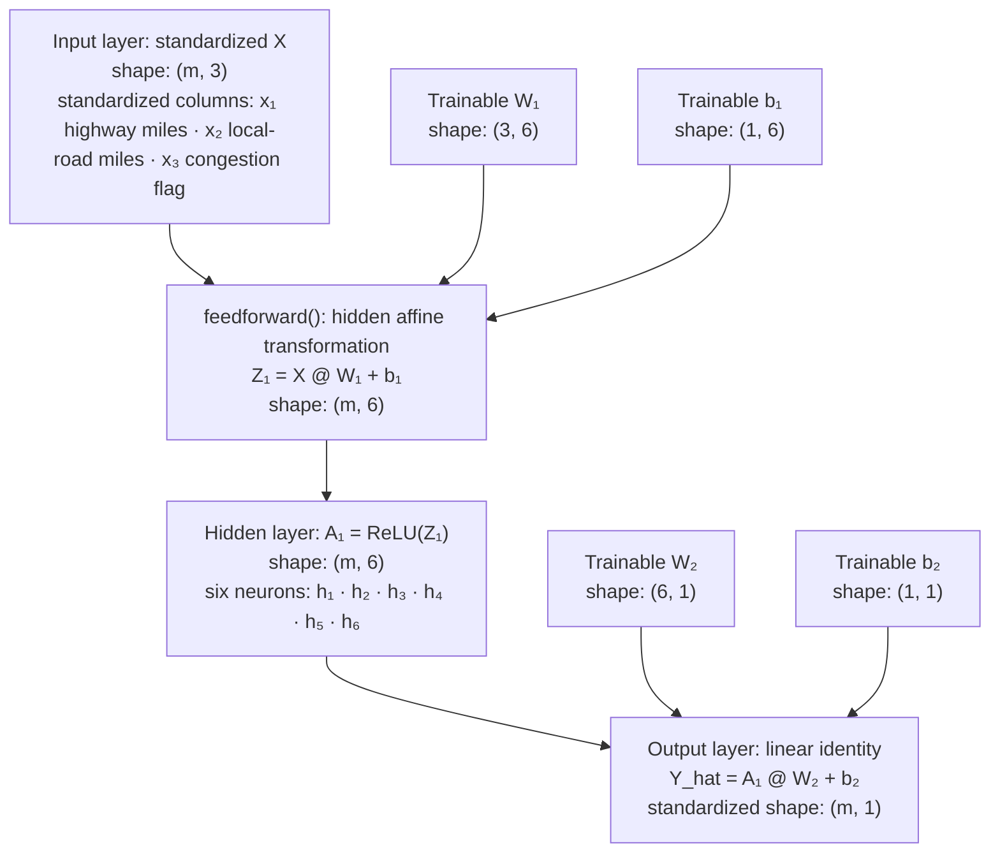

# Foundations of Artificial Intelligence – CSC510 

---

 Alexander Ricciardi (Omega.py)      

Created date: 06/20/2026  

---

Project Description:    
This repository is a collection of assignments from CSC510 – Foundations of Artificial Intelligence - CSU Global.  

**CSC510 - Foundations of Artificial Intelligence**   

In this graduate course, students will apply the principles associated with Artificial Intelligence (AI). Students will determine how to utilize structures to represent graphs associated with data exploration. Students will gain an understanding of how to effectively apply knowledge representation and techniques associated with AI reasoning. Topics that students will explore include techniques used to efficiently apply game theory, integer programming, continuous optimization, and probability analysis.

**Course Learning Outcomes:**     
1. Identify intelligent search methods for a specific Artificial Intelligence problem.
2. Create an effective solution to solve a search problem using computational theories.
3. Explain the effects of intelligent decision-making in knowledge representation.
4. Implement solutions that utilize propositional logic and first-order logic.
5. Demonstrate how to use Bayesian probability to represent uncertainty in Artificial Intelligence.
6. Implement a solution that utilizes symbolic planning.
7. Explain the concepts associated with machine learning

---

Foundations of Artificial Intelligence CSC510   
Professor: Dr. Isaac Gang  
Fall A (26FA) – 2026   
Student: Alexander (Alex) Ricciardi   

Final grade: 

---

My Links:

<p align="left">
<a href="https://github.com/AngryOwlAI/"></a>
<a href="https://www.alexomegapy.com"></a><a href="https://www.alexomegapy.com"></a>
<a href="https://medium.com/@alex.omegapy"></a>
<a href="https://x.com/AlexOmegapy"></a>
<a href="https://www.youtube.com/@AngryOwl-AI"></a>
<a href="https://www.facebook.com/profile.php?id=100089638857137"></a>
<a href="https://linkedin.com/in/alex-ricciardi"></a>
<a href="https://www.threads.net/@alexomegapy?hl=en"></a>
<a href="https://dev.to/alex_ricciardi"></a>
</p>
   
---

Requirements:  

[](https://www.python.org/downloads/)
[](https://www.tensorflow.org/)
[](https://pytorch.org/)
[](https://numpy.org/)
[](https://pandas.pydata.org/)

---

#### Project Map  

- Critical Thinking Module 4
- Portfolio Milestone Module 4
- Critical Thinking Module 3
- Portfolio Milestone Module 3
- Portfolio Milestone Module 2
- Discussions

---
---

## Critical Thinking Module 4
Directory: [Critical-Thinking-Module-4](https://github.com/Omegapy/My-Academics-Portfolio/tree/main/MS-in-AI-Machine-and-Learning/CSC510-Foundations-of-Artificial-Intelligence/Critical-Thinking-Module-4)   
Title: Critical Thinking Module 4: Hospital Medication-Delivery Robot Route Planner Using A* Graph Search

---
---

**Assignment:**

Heuristic search functions used in Informed Search methods represent a compelling AI development strategy capable of performing many possible functions and solving a wide variety of problems.

Review the following resources:

- <https://pypi.org/project/simpleai/>
- <https://github.com/simpleai-team/simpleai>

Examine the examples given under the "samples" directory in the simpleai Github page (available in the resource above).

Define a simple real-world search problem requiring a heuristic solution. You can base the problem on the 8-puzzle (or n-puzzle) problem, Towers of Hanoi, or even Traveling Salesman. The problem and solution can be utilitarian or entirely inventive.

Write an interactive Python script (using either simpleAI's library or your resources) that utilizes either Best-First search, Greedy Best First search, Beam search, or A* search methods to calculate an appropriate output based on the proposed function. The search function does not have to be optimal nor efficient but must define an initial state, a goal state, reliably produce results by finding the sequence of actions leading to the goal state. Submission should be in an easily executable Python file alongside instructions for testing. Please include in your submission the type of search algorithm used along with at least a paragraph justifying your choice. In your justification, consider the following questions as a guide:

- Is your search method complete? Is it admissible?
- Does it use an evaluation function?
- Is it space-efficient? 
- What are the advantages and disadvantages of your chosen search method, and how do they fit the intended function?

Reference  
PyPI. (2021, September 2). SimpleAI (Version 0.8.3)

 **My Program**

`hospital_robot_astar.py` is a script that plans a route for a hospital medication delivery robot. The user selects a hospital location as the initial state and another as the goal state. A* search is used to find the optimal path.

The A* search must account for the cost of moving through different types of cells. Normal corridors cost `1` unit to enter, busy corridors cost `3`, and sanitation work zones cost `6`. Walls are blocked. The route planner can therefore prefer a longer clear route over a shorter but more expensive route.

The Program follows the SimpleAI structure; it did not import the SimpleAI package. This allowsthe the functionality of to be inspected. The "problem class" implements the following required methods:

```text
actions(state)
result(state, action)
is_goal(state)
cost(state, action, state2)
heuristic(state)
```

Search Example:

```text
Initial state: P - Pharmacy at (row 1, column 1)
Goal state:    E - Emergency Department at (row 11, column 29)
```

The verified result is:

```text
Movement actions: 38
Total route cost: 44 cost units
Goal reached: True
```

The route contains 34 normal corridor entries, 3 busy corridor entries, and the final goal location. It avoids all sanitation work-zone cells.

**Real-World Search Problem**

**Fictional Scenario**

A hospital decided to automate the delivery of medication and supplies using a small autonomous robot. A normal corridor is easy to traverse. A busy corridor requires the robot to slow down. A sanitation work zone is traversable, but it has a higher traversal cost and should be avoided when possible.

The function of the program is to calculate a low-cost movement plan from a selected hospital location to another selected location.

**Locations**

| Code | Hospital Location          | Coordinate |
| ---- | -------------------------- | ---------- |
| P    | Pharmacy                   | (1, 1)     |
| N    | Nurses' Station            | (1, 31)    |
| L    | Laboratory                 | (11, 1)    |
| E    | Emergency Department       | (11, 29)   |
| S    | Medical Supply Room        | (13, 1)    |
| C    | Robot Charging Station     | (13, 31)   |

**Initial State**

The initial state is the coordinate of the selected starting location:

```text
s0 = (start_row, start_column)
```

The default demonstration uses:

```text
s0 = (1, 1) = Pharmacy
```

**Goal State**

The goal state is the coordinate of the selected destination:

```text
sg = (goal_row, goal_column)
```

The default demonstration uses:

```text
sg = (11, 29) = Emergency Department
```

### State Representation

Every state is an immutable tuple:

```python
state = (row, column)
```

Tuple states are hashable. The graph-search implementation can therefore use them as dictionary keys when it stores the best discovered route cost for each coordinate.

**Actions**

The robot can perform these actions:

```text
MOVE UP
MOVE RIGHT
MOVE DOWN
MOVE LEFT
```

An action is legal only when its successor coordinate is inside the map and is not a wall.

**Result Function**

Each action applies a row-column offset:

```text
MOVE UP:    s' = (row - 1, column)
MOVE RIGHT: s' = (row, column + 1)
MOVE DOWN:  s' = (row + 1, column)
MOVE LEFT:  s' = (row, column - 1)
```

**Goal Test**

```text
is_goal(s) = True when s == sg
```

**Constraints**

- The map is finite and rectangular.
- The outer border is a wall.
- The robot cannot enter `#` cells.
- The robot moves one orthogonal cell per action.
- Diagonal movement is not permitted.
- Every legal movement has a positive finite cost.
- Interactive execution requires different start and goal locations.

---

**Hospital Floor Map**

```text
    Column numbers
    0         10        20        30
 0  #################################
 1  #P..............#..............N#
 2  #.###########...#...###########.#
 3  #...............#...............#
 4  #.#####.#################.#####.#
 5  #.....#.......~~~.......#.......#
 6  #####.#.#####.~~~.#####.#.#######
 7  #.....#.....#..~~~#.....#.......#
 8  #.#########.#..!!!#.###########.#
 9  #...........#.....#.............#
10  #.###########.!!!.###########...#
11  #L............!!!............E..#
12  #.###############.#############.#
13  #S.............................C#
14  #################################
```

### Traversal-Cost Model

| Symbol     | Meaning          | Cost to enter |
| ---------- | ---------------- | ------------: |
| #          | Wall             | Blocked       |
| .          | Normal corridor  | 1             |
| ~          | Busy corridor    | 3             |
| !          | Sanitation zone  | 6             |
| P,N,L,E,S,C | Named location  | 1             |

The cost belongs to the destination cell. For example, moving from a normal corridor into a busy corridor costs `3` units.

---

[Go back to the Project Map](#project-map)  

---
---

## Portfolio Milestone Module 4
Directory: [Portfolio-Milestone-Module-4](https://github.com/Omegapy/My-Academics-Portfolio/tree/main/MS-in-AI-Machine-and-Learning/CSC510-Foundations-of-Artificial-Intelligence/Portfolio-Milestone-Module-4)   
Title: Portfolio Milestone Module 4: Neural Networks for CubeSat Telemetry Anomaly Detection - A* Search

---
---

**Assignment:**

**Portfolio Milestone Module 4**

Write at least one paragraph describing how you might use intelligent search methods in your chosen use-case scenario. Which search methods might you choose to use? To what task will these search methods be applied?

**Grading Criteria:** 

- Your paper should be 1 paragraph in length, not including the cover page and references page.
- Your paper must be formatted according to APA guidelines in the CSU Global Writing Center (available in the left-hand navigation panel).
- Your claims should be supported by evidence. Include at least 1 credible references in addition to the course textbook. The CSU Global Library (available in the left-hand navigation panel) is a good place to find these references.
- All references must be cited in the text and listed on the references page, according to APA formatting.

---

**Portfolio Project**

AI Use - Case Problem With Solution
Your final Portfolio Project will be a fully-functioning AI program built to solve a real-world problem of your choosing, utilizing the tools and techniques outlined in this course. Your program will interact with human beings to support decision-making processes by delivering relevant information about the problem.

Your final project submission should include a self-executable Python program. The program should be complete and straightforward to test. The program should leverage methods learned from at least 2 of the modules from this course. The submission must function and be a reasonable attempt at a solution for your chosen problem. The solution does not have to be correct or useful in the real world, but the solution MUST provide reasonable answers without error.

In addition to your program, your submission should include a 2-4 page essay describing the final version of your AI program, the use-case it intends to solve, and the methods you used toward that goal. In your paper, please address the following details:

- The tools, libraries, and APIs utilized,
- Search methods used and how they contributed toward the program goal,
- Inclusion of any deep learning models,
- Aspects of your program that utilize expert system concepts,
- How your program represent knowledge,
- How symbolic planning is used in your program (remember, symbolic planning is not limited to robot navigation).

**Prior Milestone Submissions**

see:
- Portfolio_milestone-Module-2.pdf
- Portfolio_milestone-Module-3.pdf

---

[Go back to the Project Map](#project-map) 

---
---

## Critical Thinking Module 3
Directory: [Critical-Thinking-Module-3](https://github.com/Omegapy/My-Academics-Portfolio/tree/main/MS-in-AI-Machine-and-Learning/CSC510-Foundations-of-Artificial-Intelligence/Critical-Thinking-Module-3)   
Title: Critical Thinking Module 3: Hand-Made Shallow ANN in Python

---
---

**Assignment:**

Hand-Made Shallow ANN in Python
Using your research and resources, write a basic 2-layer Artificial Neural Network utilizing static backpropagation using Numpy in Python. Your neural network can perform a basic function, such as guessing the next number in a series. Using the activation function of your choice to calculate the predicted output ŷ, known as the feedforward function, and updating the weights and biases through gradient descent (backpropagation) based on your choice of a basic loss function.  

Your ANN should include the following features:  

- An input layer that takes input data as a matrix receives and passes it on
- A hidden layer
- An output layer
- Weights between the layers.

Also, your ANN should demonstrate it can perform the following functions:

- Multiply the input by a set of weights (via matrix multiplication)
- Apply deliberate activation function for every hidden layer
- Return an output
- Calculate error by taking the difference from the desired output and the predicted output giving us the gradient descent to provide our loss function
- Apply loss function to weights
- Repeat this process no less than 1,000 times to train the ANN

Your submission should be a script with the .py extension. It should be able to be activated easily and have the ability to accept simple inputs, such as a series of a particular number of variables or digits, in a manner that is clear to the user and predict and visually the final variable in the input set. The input and output are up to you. Keep it simple. 

**Program Overview**

`handmade_shallow_ann.py` is a small standalone Python script that implements a hand-made shallow artificial neural network using only NumPy.  
The program predicts a store delivery duration in minutes to a customer's place based on three user inputs:

- Highway miles
- Local-road miles
- A congestion flag, where `0` means normal traffic and `1` means congested traffic

The model uses a `3 -> 6 -> 1` neural network architecture:

- Three input values
- One hidden layer containing six ReLU neurons
- One linear output that predicts a continuous standardized target
- Two trainable weight matrices and two trainable bias arrays

The raw inputs and targets are standardized before the ANN receives them. 

**Synthetic Training Data**

The script constructs a deterministic supervised-learning dataset from every combination in this
grid:

| Feature | Values used for training | Count |
| --- | --- | ---: |
| `x1`, highway miles | `0` through `30` in increments of `2` | 16 |
| `x2`, local-road miles | `0` through `10` in increments of `1` | 11 |
| `x3`, congestion flag | `0` for normal or `1` for congested | 2 |

This produces `16 * 11 * 2 = 352` paired examples: raw `X` has shape `(352, 3)` and
raw `Y` has shape `(352, 1)`. Each synthetic target is calculated independently of the ANN:

```text
highway_speed = 50 mph when x3 = 0; 25 mph when x3 = 1
Y_minutes = 10 + (x1 / highway_speed) * 60 + (x2 / 20) * 60
```

The `10` is the fictional preparation time, and `20 mph` is the assumed local-road speed. These
targets are classroom data, not real delivery-time estimates. The generated pairs are all used for
full-batch training; the script does not create a separate validation or test split.

### ANN Architecture



---

[Go back to the Project Map](#project-map)  

---
---

## Portfolio Milestone Module 3
Directory: [Portfolio-Milestone-Module-3](https://github.com/Omegapy/My-Academics-Portfolio/tree/main/MS-in-AI-Machine-and-Learning/CSC510-Foundations-of-Artificial-Intelligence/Portfolio-Milestone-Module-3)   
Title: Portfolio Milestone Module 3: Neural Networks for CubeSat Telemetry Anomaly Detection

---
---

**Assignment:**

**Project Update**

Neural networks can be leveraged for many "fuzzy" tasks and are extremely useful for classifying data. Conduct research on the use-case scenario you have chosen. Using what you have learned, write at least a paragraph expressing your thoughts on if and how your chosen use-case scenario uses neural networks.

**Grading Criteria:** 

- Your paper should be 1 paragraph in length, not including the cover page and references page.
- Your paper must be formatted according to APA guidelines in the CSU Global Writing Center (available in the left-hand navigation panel).
- Your claims should be supported by evidence. Include at least 1 credible references in addition to the course textbook. The CSU Global Library (available in the left-hand navigation panel) is a good place to find these references.
- All references must be cited in the text and listed on the references page, according to APA formatting.

**Portfolio Project**

AI Use - Case Problem With Solution
Your final Portfolio Project will be a fully-functioning AI program built to solve a real-world problem of your choosing, utilizing the tools and techniques outlined in this course. Your program will interact with human beings to support decision-making processes by delivering relevant information about the problem.

Your final project submission should include a self-executable Python program. The program should be complete and straightforward to test. The program should leverage methods learned from at least 2 of the modules from this course. The submission must function and be a reasonable attempt at a solution for your chosen problem. The solution does not have to be correct or useful in the real world, but the solution MUST provide reasonable answers without error.

In addition to your program, your submission should include a 2-4 page essay describing the final version of your AI program, the use-case it intends to solve, and the methods you used toward that goal. In your paper, please address the following details:

- The tools, libraries, and APIs utilized,
- Search methods used and how they contributed toward the program goal,
- Inclusion of any deep learning models,
- Aspects of your program that utilize expert system concepts,
- How your program represent knowledge,
- How symbolic planning is used in your program (remember, symbolic planning is not limited to robot navigation).

**Prior Milestone Submissions**

see Portfolio_milestone-Module-2.pdf

---

[Go back to the Project Map](#project-map)  

---
---

## Portfolio Milestone Module 2
Directory: [Portfolio-Milestone-Module-2](https://github.com/Omegapy/My-Academics-Portfolio/tree/main/MS-in-AI-Machine-and-Learning/CSC510-Foundations-of-Artificial-Intelligence/Portfolio-Milestone-Module-2)   
Title: Portfolio Milestone Module 2: Use-Case Scenario Proposal

---
---

**Assignment:**

**Choosing a Use-Case Scenario**

Your final Portfolio Project will be a fully-functioning AI program built to solve a real-world problem of your choosing, utilizing the tools and techniques outlined in this course. Your program will interact with human beings to support decision-making processes by delivering relevant information about the problem.

For your first milestone, it will be necessary to choose a use-case scenario for which to deploy your project.

Write at least one paragraph outlining your chosen use-case scenario. Include a general description of the problem, the function your solution will perform, and a generalized strategy of how your solution might solve the problem. While writing, assume your ideas will change before we reach the end of this course. For your benefit, here are some resources regarding the current uses of AI in the field:

- Everson, K. (2019). Five keys to intelligently deploy AI and automation.Links to an external site. Policy & Practice (19426828), 77(4), 24–35. 
- Dovey Fishman, T., & Eggers, W. D. (2017). AI-augmented human services.Links to an external site. Policy & Practice (19426828), 75(6), 26–39.
- Heller, C.H. (2019). Near-term applications of artificial intelligence: Implementation opportunities from modern business practices.Links to an external site. Naval War College Review, 72(4).
- Dillon, J. D. (2020). The path to AI.Links to an external site. TD: Talent Development, 74(1), 24-29.
- Newcombe, T. (2018). Practically speaking: Everyday uses of artificial intelligence that can talk, listen and see are coming. Is government ready?Links to an external site. Government Technology, 31(5), 24–28.

**Grading Criteria:** 

- Your paper should be 1 paragraph in length, not including the cover page and references page.
- Your paper must be formatted according to APA guidelines in the CSU Global Writing Center (available in the left-hand navigation panel).
- Your claims should be supported by evidence. Include at least 1 credible references in addition to the course textbook. The CSU Global Library (available in the left-hand navigation panel) is a good place to find these references.
- All references must be cited in the text and listed on the references page, according to APA formatting.

**Portfolio Project**

AI Use - Case Problem With Solution
Your final Portfolio Project will be a fully-functioning AI program built to solve a real-world problem of your choosing, utilizing the tools and techniques outlined in this course. Your program will interact with human beings to support decision-making processes by delivering relevant information about the problem.

Your final project submission should include a self-executable Python program. The program should be complete and straightforward to test. The program should leverage methods learned from at least 2 of the modules from this course. The submission must function and be a reasonable attempt at a solution for your chosen problem. The solution does not have to be correct or useful in the real world, but the solution MUST provide reasonable answers without error.

In addition to your program, your submission should include a 2-4 page essay describing the final version of your AI program, the use-case it intends to solve, and the methods you used toward that goal. In your paper, please address the following details:

- The tools, libraries, and APIs utilized,
- Search methods used and how they contributed toward the program goal,
- Inclusion of any deep learning models,
- Aspects of your program that utilize expert system concepts,
- How your program represent knowledge,
- How symbolic planning is used in your program (remember, symbolic planning is not limited to robot navigation).

---

[Go back to the Project Map](#project-map)  

----
----

## Discussions 
This repository is a collection of discussion posts from CSC506 – Design and Analysis of Algorithms  
Directory: [Discussions]([...])

---

[Go back to the Project Map](#project-map)


